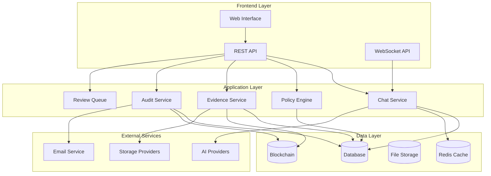

# Civic Attestation Platform (CAP)

[](https://github.com/QuietWire-Civic-AI/Civic_Attestation_Platform)
[](LICENSE)
[](https://python.org)
[](https://frappe.io)

> **CAP** (Civic Attestation Platform) is a comprehensive compliance and governance platform that integrates AI-powered chat capabilities with real-time policy enforcement and automated compliance monitoring.

## 🚀 Features

### 🤖 AI-Powered Chat Integration
- **Multi-Model Support**: Support for multiple AI providers (OpenAI, Anthropic, Azure, Google)
- **Real-time Chat**: WebSocket-based real-time messaging
- **Session Management**: Complete chat session lifecycle management
- **Token Tracking**: Real-time usage monitoring and cost tracking

### 🛡️ Compliance & Policy Management
- **Dynamic Policy Engine**: Real-time policy enforcement and validation
- **Violation Detection**: AI-powered violation detection with multiple severity levels
- **Automated Remediation**: Configurable remediation workflows
- **Compliance Scoring**: Real-time compliance score calculation

### 📊 Evidence Management
- **Chain of Custody**: Complete audit trail for all evidence
- **Version Control**: Evidence versioning with change tracking
- **Automated Verification**: AI-powered evidence verification
- **Integration Support**: Links to policies, violations, and chat sessions

### 🔍 Audit & Monitoring
- **Comprehensive Logging**: Complete audit trail for all system activities
- **Real-time Alerts**: Automated alert system for compliance violations
- **Performance Monitoring**: Real-time system health and performance metrics
- **Blockchain Anchoring**: Immutable event logging via blockchain

### 📈 Analytics & Reporting
- **Real-time Dashboards**: Live compliance and usage dashboards
- **Automated Reports**: Scheduled compliance, usage, and financial reports
- **Trend Analysis**: Historical data analysis and trend identification
- **Custom Metrics**: Configurable KPI tracking

## 🏗️ Architecture



## 🛠️ Installation

### Prerequisites

- **Python 3.9+**
- **Frappe Framework 15.x**
- **Redis** (for caching and sessions)
- **MariaDB/MySQL** (database)
- **Node.js 16+** (for Frappe frontend)

### Quick Start

1. **Clone the Repository**
```bash
git clone https://github.com/QuietWire-Civic-AI/Civic_Attestation_Platform.git
cd Civic_Attestation_Platform
```

2. **Setup Frappe Environment**
```bash
cd apps/cap
pip install -r requirements.txt
```

3. **Database Setup**
```bash
frappe --site your-site install-app cap
```

4. **Initialize Application**
```bash
bench --site your-site set-config developer_mode 1
bench --site your-site migrate
```

5. **Start Development Server**
```bash
bench start
```

### Docker Installation

```bash
# Using Docker Compose
git clone https://github.com/QuietWire-Civic-AI/Civic_Attestation_Platform.git
cd Civic_Attestation_Platform
docker-compose up -d

# Or build manually
docker build -t cap-platform .
docker run -d -p 8000:8000 cap-platform
```

## 📖 Documentation

### 📚 Available Guides

| Document | Description |
|----------|-------------|
| [**User Guide**](apps/cap/docs/USER_GUIDE.md) | Complete user documentation and how-to guides |
| [**Developer Guide**](apps/cap/docs/DEVELOPER_GUIDE.md) | Development setup and API documentation |
| [**Workflows Documentation**](apps/cap/docs/WORKFLOWS_DOCUMENTATION.md) | Detailed workflow diagrams and processes |
| [**Use Case Scenarios**](apps/cap/docs/USE_CASE_SCENARIOS.md) | Real-world usage scenarios and examples |

### 🗂️ Documentation Structure

```
docs/
├── USER_GUIDE.md                 # End-user documentation
├── DEVELOPER_GUIDE.md            # Developer documentation
├── WORKFLOWS_DOCUMENTATION.md    # Workflow diagrams
├── USE_CASE_SCENARIOS.md         # Usage scenarios
├── api/
│   └── README.md                # API documentation
├── architecture/
│   └── README.md                # System architecture
├── deployment/
│   └── README.md                # Deployment guide
└── guides/
    ├── development.md           # Development best practices
    └── testing.md               # Testing guide
```

## 🔧 Configuration

### Environment Variables

```bash
# AI Configuration
OPENAI_API_KEY=your_openai_key
ANTHROPIC_API_KEY=your_anthropic_key

# Database
DB_HOST=localhost
DB_PORT=3306
DB_USER=root
DB_PASSWORD=your_password

# Redis
REDIS_URL=redis://localhost:6379

# Security
SECRET_KEY=your_secret_key
ENCRYPTION_KEY=your_encryption_key

# External Services
SMTP_SERVER=smtp.gmail.com
SMTP_PORT=587
SMTP_USER=your_email
SMTP_PASSWORD=your_password
```

### System Settings

Configure the platform through the admin interface:

1. **AI Models**: Configure AI providers and models
2. **Policies**: Set up compliance policies and enforcement levels
3. **Evidence**: Configure evidence retention and verification
4. **Alerts**: Set up notification rules and escalation
5. **Storage**: Configure file storage providers

## 🧪 Testing

### Run Tests

```bash
# Unit tests
pytest cap/tests/unit/

# Integration tests
pytest cap/tests/integration/

# API tests
pytest cap/tests/api/

# All tests
pytest cap/tests/
```

### Test Coverage

```bash
# Generate coverage report
pytest --cov=cap --cov-report=html

# View coverage in browser
open htmlcov/index.html
```

## 📊 Usage Examples

### Creating a Chat Session

```python
from cap.services.chat_service import ChatService

# Initialize service
chat_service = ChatService()

# Create new session
session = chat_service.create_session(
    tenant_id="tenant_123",
    user_id="user_456",
    model_config="gpt-4-turbo",
    title="Compliance Review Session"
)

# Send message
response = chat_service.send_message(
    session_id=session.name,
    content="Analyze this document for compliance violations",
    attachments=[evidence_file]
)
```

### Managing Policies

```python
from cap.services.policy_service import PolicyService

policy_service = PolicyService()

# Create new policy
policy = policy_service.create_policy(
    name="Data Privacy Policy",
    policy_type="Privacy",
    enforcement_level="Blocking",
    rules=[
        {"pattern": "ssn", "action": "Block"},
        {"pattern": "credit_card", "action": "Warn"}
    ]
)

# Activate policy
policy_service.activate_policy(policy.name)
```

### Evidence Verification

```python
from cap.services.evidence_service import EvidenceService

evidence_service = EvidenceService()

# Submit evidence for verification
evidence = evidence_service.create_evidence(
    title="Contract Document",
    content="Contract text content",
    evidence_type="Document"
)

# Verify evidence
result = evidence_service.verify_evidence(evidence.name, auto_verify=True)
```

## 🔄 API Endpoints

### Chat API

```http
# Create chat session
POST /api/cap/chat/session
{
  "model_configuration": "gpt-4-turbo",
  "session_type": "General"
}

# Send message
POST /api/cap/chat/message
{
  "session_id": "session_123",
  "content": "Hello, can you help me?",
  "citations": []
}
```

### Policy API

```http
# Create policy
POST /api/cap/compliance/policy
{
  "name": "Content Policy",
  "enforcement_level": "Warning",
  "rules": [
    {"pattern": "inappropriate", "action": "Warn"}
  ]
}

# List violations
GET /api/cap/compliance/violations?status=Open
```

### Evidence API

```http
# Upload evidence
POST /api/cap/operations/evidence
{
  "title": "Important Document",
  "evidence_type": "Document"
}

# Get evidence chain of custody
GET /api/cap/operations/evidence/evidence_123/custody
```

## 🛡️ Security

### Security Features

- **Multi-tenant Isolation**: Complete tenant data separation
- **Role-based Access Control**: Granular permission management
- **Data Encryption**: AES-256 encryption for sensitive data
- **Audit Logging**: Complete audit trail for all actions
- **API Security**: Rate limiting and authentication
- **Compliance Enforcement**: Real-time policy violation detection

### Security Best Practices

1. **Always use HTTPS in production**
2. **Regularly rotate API keys and secrets**
3. **Enable 2FA for all admin accounts**
4. **Monitor audit logs for suspicious activity**
5. **Keep dependencies updated**

## 🚀 Deployment

### Production Deployment

See [Deployment Guide](apps/cap/docs/deployment/README.md) for detailed production deployment instructions.

### Deployment Options

- **Frappe Cloud**: Managed Frappe hosting
- **Docker**: Containerized deployment
- **Kubernetes**: Scalable Kubernetes deployment
- **Traditional VPS**: Manual server deployment

## 🤝 Contributing

We welcome contributions! Please see our [Contributing Guide](CONTRIBUTING.md) for details.

### Development Process

1. **Fork the repository**
2. **Create a feature branch**: `git checkout -b feature/amazing-feature`
3. **Make your changes**
4. **Add tests** for new functionality
5. **Ensure tests pass**: `pytest`
6. **Commit your changes**: `git commit -m 'Add amazing feature'`
7. **Push to branch**: `git push origin feature/amazing-feature`
8. **Open a Pull Request**

### Code Standards

- **Python**: Follow PEP 8 style guide
- **JavaScript**: Follow ESLint configuration
- **Testing**: Maintain >80% test coverage
- **Documentation**: Update docs for new features

## 📈 Roadmap

### Version 1.1 (Q2 2025)
- [ ] Advanced AI model integration (Claude, Gemini)
- [ ] Enhanced reporting dashboard
- [ ] Mobile app support
- [ ] Advanced analytics

### Version 1.2 (Q3 2025)
- [ ] Multi-language support expansion
- [ ] Advanced workflow automation
- [ ] Integration with external compliance tools
- [ ] Enhanced security features

### Version 2.0 (Q4 2025)
- [ ] AI-powered compliance recommendations
- [ ] Automated audit preparation
- [ ] Advanced risk assessment
- [ ] Enterprise SSO integration

## 🆘 Support

### Getting Help

- **Documentation**: Check the [documentation](apps/cap/docs/)
- **Issues**: Report bugs on [GitHub Issues](https://github.com/QuietWire-Civic-AI/Civic_Attestation_Platform/issues)
- **Discussions**: Join community discussions
- **Email**: cap@quietwire.ai

### Community

- **Website**: [quietwire.ai](https://quietwire.ai)
- **Documentation**: Full documentation available in the repository
- **Support**: Contact us at cap@quietwire.ai for assistance

## 📄 License

This project is licensed under the Apache License 2.0 - see the [LICENSE](LICENSE) file for details.

## 🙏 Acknowledgments

- **Frappe Framework**: For the robust platform foundation
- **OpenAI**: For AI model capabilities
- **Community Contributors**: For their valuable contributions
- **Frappe Community**: For ongoing support and resources

---

## 📊 Project Stats


---

**Made with ❤️ by the CAP Team**

*For questions or support, please open an issue or contact us at cap@quietwire.ai*
