# Civic AI Canon Platform (CAP) - Workflows Documentation

**Version:** 2.0.0  
**Last Updated:** October 23, 2025  
**Platform:** Civic AI Canon Platform (CAP)  
**Author:** Ashraf Al-hajj & Raasid

---

## Table of Contents

1. [Introduction](#1-introduction)
2. [Workflow Visualization Guide](#2-workflow-visualization-guide)
3. [Core Module Workflows](#3-core-module-workflows)
4. [AI Module Workflows](#4-ai-module-workflows)
5. [Compliance Module Workflows](#5-compliance-module-workflows)
6. [Operations Module Workflows](#6-operations-module-workflows)
7. [Analytics Module Workflows](#7-analytics-module-workflows)
8. [Cross-Module Workflows](#8-cross-module-workflows)
9. [Background Jobs & Automation](#9-background-jobs--automation)
10. [Integration Workflows](#10-integration-workflows)

---

## 1. Introduction

### 1.1 Workflow Overview

This document provides a comprehensive, visual description of all workflows within the Civic AI Canon Platform (CAP). Each workflow is presented with:

- **Visual Diagrams**: Mermaid flowcharts for easy understanding
- **State Machines**: Clear state transitions and conditions
- **Detailed Steps**: Complete process documentation
- **Integration Points**: System interconnections
- **Error Handling**: Exception and recovery flows

### 1.2 Workflow Categories

- **Core Workflows**: Tenant management, user administration, system configuration
- **AI Workflows**: Chat sessions, model management, AI interactions
- **Compliance Workflows**: Policy enforcement, violation handling, reviews
- **Operations Workflows**: Evidence management, audit logs, maintenance
- **Analytics Workflows**: Reporting, metrics collection, dashboard updates

### 1.3 Document Conventions

**Diagram Legend:**
- 🔵 **Blue Boxes**: Normal process steps
- 🟢 **Green Boxes**: Success states
- 🔴 **Red Boxes**: Error/rejection states
- 🟡 **Yellow Boxes**: Warning/pending states
- ⚪ **White Boxes**: Decision points
- ➡️ **Arrows**: Process flow direction

---

## 2. Workflow Visualization Guide

### 2.1 Reading Flowcharts

All flowcharts in this document follow these conventions:

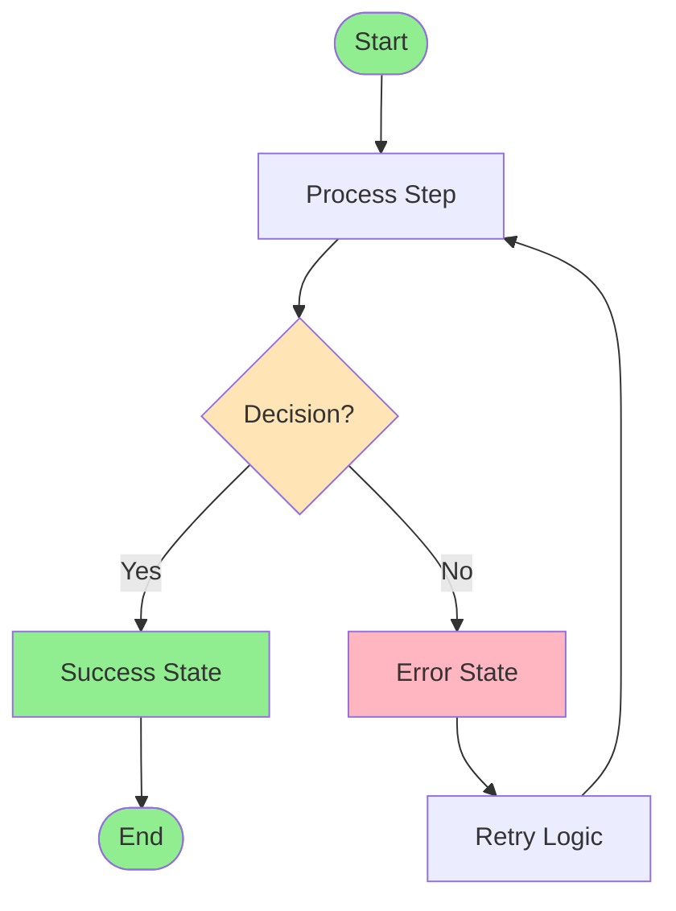
```mermaid
graph TD
    Start([Start]) --> Process[Process Step]
    Process --> Decision{Decision?}
    Decision -->|Yes| Success[Success State]
    Decision -->|No| Error[Error State]
    Success --> End([End])
    Error --> Retry[Retry Logic]
    Retry --> Process
    
    style Start fill:#90EE90
    style End fill:#90EE90
    style Success fill:#90EE90
    style Error fill:#FFB6C1
    style Decision fill:#FFE4B5
```

### 2.2 State Diagram Conventions

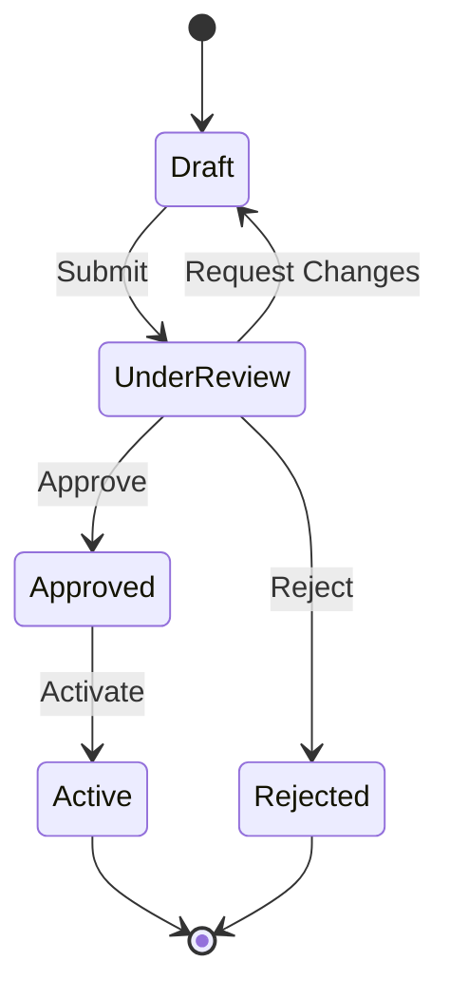
```mermaid
stateDiagram-v2
    [*] --> Draft
    Draft --> UnderReview: Submit
    UnderReview --> Approved: Approve
    UnderReview --> Rejected: Reject
    UnderReview --> Draft: Request Changes
    Approved --> Active: Activate
    Active --> [*]
    Rejected --> [*]
```

---

## 3. Core Module Workflows

### 3.1 Tenant Onboarding Workflow

#### 3.1.1 Visual Flow Diagram

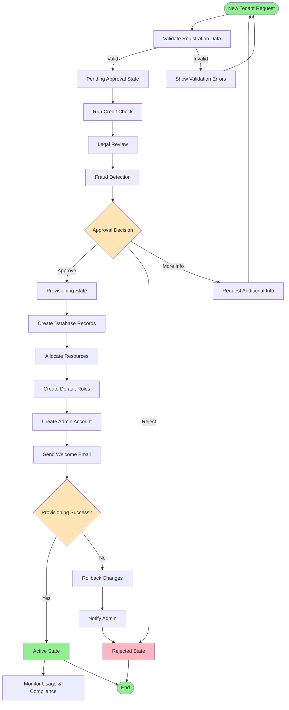
```mermaid
flowchart TD
    Start([New Tenant Request]) --> Validate[Validate Registration Data]
    Validate -->|Valid| PendingApproval[Pending Approval State]
    Validate -->|Invalid| ErrorMsg[Show Validation Errors]
    ErrorMsg --> Start
    
    PendingApproval --> CreditCheck[Run Credit Check]
    CreditCheck --> LegalReview[Legal Review]
    LegalReview --> FraudCheck[Fraud Detection]
    
    FraudCheck --> Decision{Approval Decision}
    Decision -->|Approve| Provision[Provisioning State]
    Decision -->|Reject| Rejected[Rejected State]
    Decision -->|More Info| RequestInfo[Request Additional Info]
    RequestInfo --> Start
    
    Provision --> CreateDB[Create Database Records]
    CreateDB --> AllocateRes[Allocate Resources]
    AllocateRes --> CreateRoles[Create Default Roles]
    CreateRoles --> CreateAdmin[Create Admin Account]
    CreateAdmin --> SendEmail[Send Welcome Email]
    
    SendEmail --> ProvisionCheck{Provisioning Success?}
    ProvisionCheck -->|Yes| Active[Active State]
    ProvisionCheck -->|No| Rollback[Rollback Changes]
    Rollback --> NotifyError[Notify Admin]
    NotifyError --> Rejected
    
    Active --> Monitor[Monitor Usage & Compliance]
    Rejected --> End([End])
    Active --> End
    
    style Start fill:#90EE90
    style Active fill:#90EE90
    style End fill:#90EE90
    style Rejected fill:#FFB6C1
    style Decision fill:#FFE4B5
    style ProvisionCheck fill:#FFE4B5
```

#### 3.1.2 State Diagram

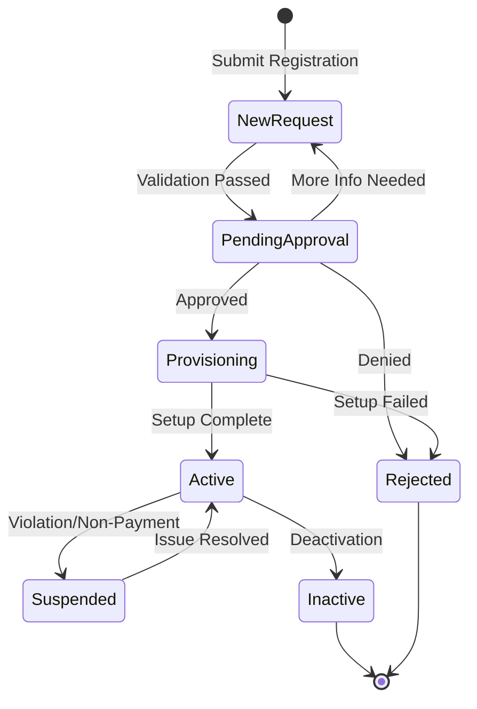
```mermaid
stateDiagram-v2
    [*] --> NewRequest: Submit Registration
    NewRequest --> PendingApproval: Validation Passed
    PendingApproval --> Provisioning: Approved
    PendingApproval --> Rejected: Denied
    PendingApproval --> NewRequest: More Info Needed
    Provisioning --> Active: Setup Complete
    Provisioning --> Rejected: Setup Failed
    Active --> Suspended: Violation/Non-Payment
    Suspended --> Active: Issue Resolved
    Active --> Inactive: Deactivation
    Inactive --> [*]
    Rejected --> [*]
```

#### 3.1.3 Detailed Process Steps

**Phase 1: New Request**

| Field | Required | Validation |
|-------|----------|------------|
| Tenant Name | Yes | Unique, 3-50 characters |
| Organization Name | Yes | 3-100 characters |
| Email Domain | Yes | Valid domain format |
| Primary Contact | Yes | Valid email |
| Plan Selection | Yes | Basic/Professional/Enterprise |
| Payment Method | Enterprise Only | Valid payment info |

**Phase 2: Approval Process**

```python
# Approval Logic
def process_tenant_approval(tenant_request):
    # Step 1: Automated Checks
    credit_score = run_credit_check(tenant_request.organization)
    fraud_score = detect_fraud(tenant_request)
    
    # Step 2: Decision Matrix
    if fraud_score > 0.8:
        return reject("High fraud risk detected")
    
    if tenant_request.plan == "Enterprise":
        if credit_score < 650:
            return request_more_info("Credit check requires review")
        # Requires manual legal review
        assign_to_legal_team(tenant_request)
    else:
        # Auto-approve for Basic/Professional
        if fraud_score < 0.3 and credit_score > 600:
            return approve_and_provision(tenant_request)
    
    # Step 3: Manual Review Required
    assign_to_approval_queue(tenant_request)
```

**Phase 3: Provisioning (Automated)**

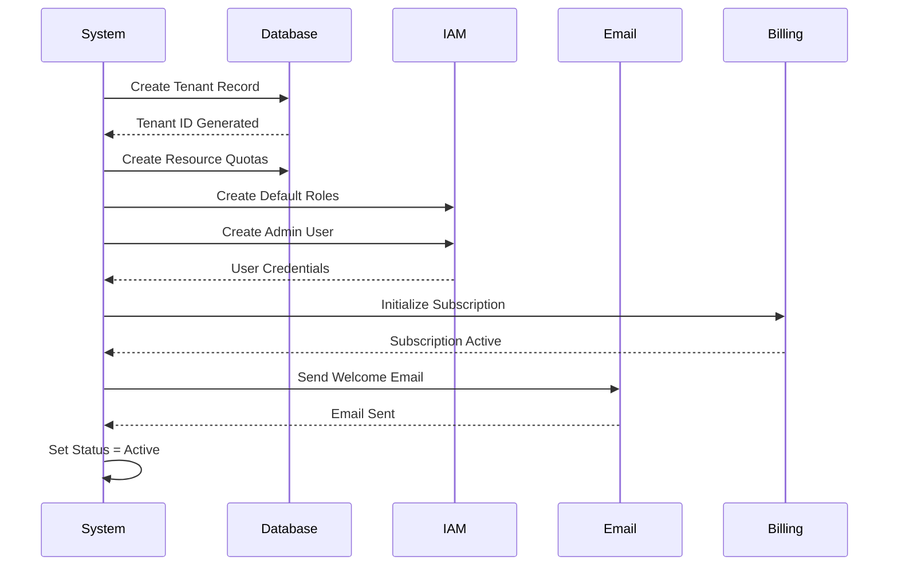
```mermaid
sequenceDiagram
    participant System
    participant Database
    participant IAM
    participant Email
    participant Billing
    
    System->>Database: Create Tenant Record
    Database-->>System: Tenant ID Generated
    
    System->>Database: Create Resource Quotas
    System->>IAM: Create Default Roles
    System->>IAM: Create Admin User
    IAM-->>System: User Credentials
    
    System->>Billing: Initialize Subscription
    Billing-->>System: Subscription Active
    
    System->>Email: Send Welcome Email
    Email-->>System: Email Sent
    
    System->>System: Set Status = Active
```

**Phase 4: Active State Monitoring**

Once active, the system continuously monitors:
- ✅ License compliance
- ✅ Resource utilization
- ✅ Payment status
- ✅ Usage patterns
- ✅ Security compliance

**SLA Commitments:**
- Approval Decision: 2 business days
- Provisioning Time: < 5 minutes (automated)
- Email Delivery: < 1 minute

---

### 3.2 User Administration Workflow

#### 3.2.1 Visual Flow Diagram

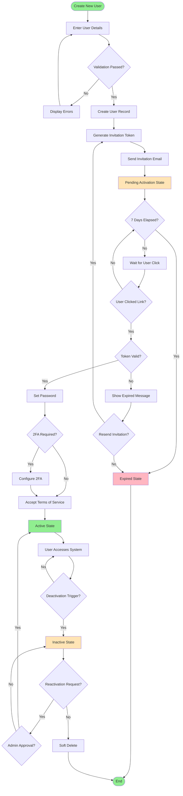
```mermaid
flowchart TD
    Start([Create New User]) --> EnterDetails[Enter User Details]
    EnterDetails --> Validate{Validation Passed?}
    Validate -->|No| ShowErrors[Display Errors]
    ShowErrors --> EnterDetails
    Validate -->|Yes| CreateRecord[Create User Record]
    
    CreateRecord --> GenToken[Generate Invitation Token]
    GenToken --> SendInvite[Send Invitation Email]
    SendInvite --> Pending[Pending Activation State]
    
    Pending --> CheckTimeout{7 Days Elapsed?}
    CheckTimeout -->|Yes| Expired[Expired State]
    CheckTimeout -->|No| WaitClick[Wait for User Click]
    
    WaitClick --> UserClick{User Clicked Link?}
    UserClick -->|Yes| ValidateToken{Token Valid?}
    UserClick -->|No| CheckTimeout
    
    ValidateToken -->|No| ExpiredLink[Show Expired Message]
    ExpiredLink --> Resend{Resend Invitation?}
    Resend -->|Yes| GenToken
    Resend -->|No| Expired
    
    ValidateToken -->|Yes| SetPassword[Set Password]
    SetPassword --> Setup2FA{2FA Required?}
    Setup2FA -->|Yes| Configure2FA[Configure 2FA]
    Setup2FA -->|No| AcceptTerms[Accept Terms of Service]
    Configure2FA --> AcceptTerms
    
    AcceptTerms --> Active[Active State]
    Active --> UseSystem[User Accesses System]
    
    UseSystem --> Deactivate{Deactivation Trigger?}
    Deactivate -->|Yes| Inactive[Inactive State]
    Deactivate -->|No| UseSystem
    
    Inactive --> Reactivate{Reactivation Request?}
    Reactivate -->|Yes| Approval{Admin Approval?}
    Reactivate -->|No| Delete[Soft Delete]
    Approval -->|Yes| Active
    Approval -->|No| Inactive
    
    Expired --> End([End])
    Delete --> End
    
    style Start fill:#90EE90
    style Active fill:#90EE90
    style Pending fill:#FFE4B5
    style Inactive fill:#FFE4B5
    style Expired fill:#FFB6C1
    style End fill:#90EE90
```

#### 3.2.2 User Lifecycle State Diagram

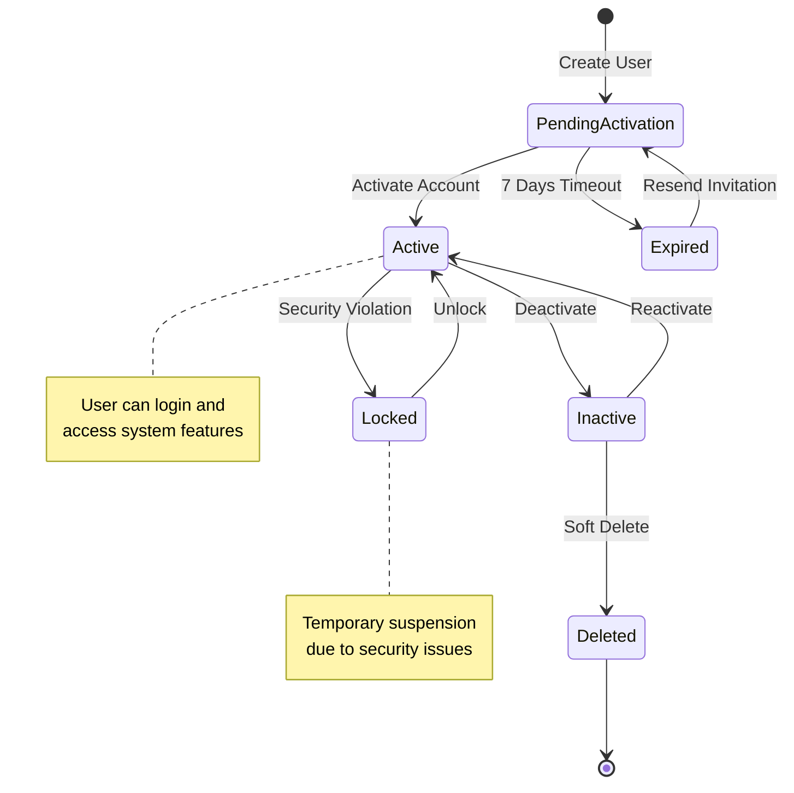
```mermaid
stateDiagram-v2
    [*] --> PendingActivation: Create User
    PendingActivation --> Active: Activate Account
    PendingActivation --> Expired: 7 Days Timeout
    Expired --> PendingActivation: Resend Invitation
    
    Active --> Inactive: Deactivate
    Inactive --> Active: Reactivate
    Inactive --> Deleted: Soft Delete
    Active --> Locked: Security Violation
    Locked --> Active: Unlock
    Deleted --> [*]
    
    note right of Active
        User can login and
        access system features
    end note
    
    note right of Locked
        Temporary suspension
        due to security issues
    end note
```

#### 3.2.3 Invitation Flow Details

**Email Invitation Template:**

```
Subject: Welcome to Civic AI Canon Platform

Hello [User Name],

You have been invited to join [Tenant Name] on the Civic AI Canon Platform.

Role: [Assigned Role]

To activate your account, please click the link below:
[Activation Link - Valid for 7 days]

If you did not expect this invitation, please ignore this email.

Best regards,
CAP Team
```

**Invitation Token Structure:**

```python
import secrets
import hashlib
from datetime import datetime, timedelta

def generate_invitation_token(user_email):
    # Generate secure random token
    raw_token = secrets.token_urlsafe(32)
    
    # Create token record
    token_record = {
        "token_hash": hashlib.sha256(raw_token.encode()).hexdigest(),
        "user_email": user_email,
        "created_at": datetime.now(),
        "expires_at": datetime.now() + timedelta(days=7),
        "used": False
    }
    
    # Store in database
    save_token(token_record)
    
    # Return raw token (only time it's available)
    return raw_token
```

#### 3.2.4 Deactivation Triggers

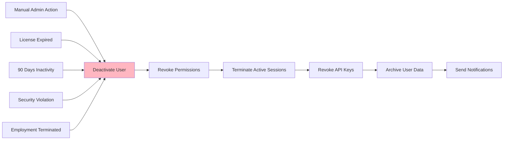
```mermaid
flowchart LR
    Manual[Manual Admin Action] --> Deactivate[Deactivate User]
    License[License Expired] --> Deactivate
    Inactive90[90 Days Inactivity] --> Deactivate
    Security[Security Violation] --> Deactivate
    Termination[Employment Terminated] --> Deactivate
    
    Deactivate --> Revoke[Revoke Permissions]
    Revoke --> EndSessions[Terminate Active Sessions]
    EndSessions --> RevokeAPI[Revoke API Keys]
    RevokeAPI --> Archive[Archive User Data]
    Archive --> Notify[Send Notifications]
    
    style Deactivate fill:#FFB6C1
```

---

### 3.3 System Settings Configuration Workflow

#### 3.3.1 Configuration Flow Diagram

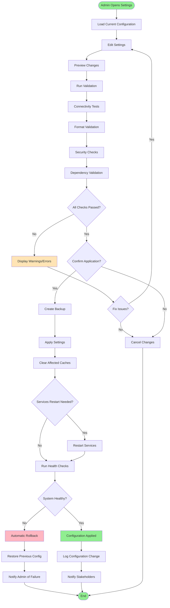
```mermaid
flowchart TD
    Start([Admin Opens Settings]) --> Load[Load Current Configuration]
    Load --> Edit[Edit Settings]
    Edit --> Preview[Preview Changes]
    
    Preview --> Validate[Run Validation]
    Validate --> ConnTest[Connectivity Tests]
    ConnTest --> FormatCheck[Format Validation]
    FormatCheck --> SecurityCheck[Security Checks]
    SecurityCheck --> DepCheck[Dependency Validation]
    
    DepCheck --> AllValid{All Checks Passed?}
    AllValid -->|No| ShowWarnings[Display Warnings/Errors]
    ShowWarnings --> Fix{Fix Issues?}
    Fix -->|Yes| Edit
    Fix -->|No| Cancel[Cancel Changes]
    
    AllValid -->|Yes| Confirm{Confirm Application?}
    Confirm -->|No| Cancel
    Confirm -->|Yes| Backup[Create Backup]
    
    Backup --> Apply[Apply Settings]
    Apply --> InvalidateCache[Clear Affected Caches]
    InvalidateCache --> RestartServices{Services Restart Needed?}
    
    RestartServices -->|Yes| Restart[Restart Services]
    RestartServices -->|No| HealthCheck[Run Health Checks]
    Restart --> HealthCheck
    
    HealthCheck --> Healthy{System Healthy?}
    Healthy -->|Yes| Success[Configuration Applied]
    Healthy -->|No| AutoRollback[Automatic Rollback]
    
    AutoRollback --> RestoreBackup[Restore Previous Config]
    RestoreBackup --> NotifyFailure[Notify Admin of Failure]
    NotifyFailure --> End([End])
    
    Success --> LogEvent[Log Configuration Change]
    LogEvent --> NotifySuccess[Notify Stakeholders]
    NotifySuccess --> End
    
    Cancel --> End
    
    style Start fill:#90EE90
    style Success fill:#90EE90
    style End fill:#90EE90
    style AutoRollback fill:#FFB6C1
    style ShowWarnings fill:#FFE4B5
```

#### 3.3.2 Validation Sequence

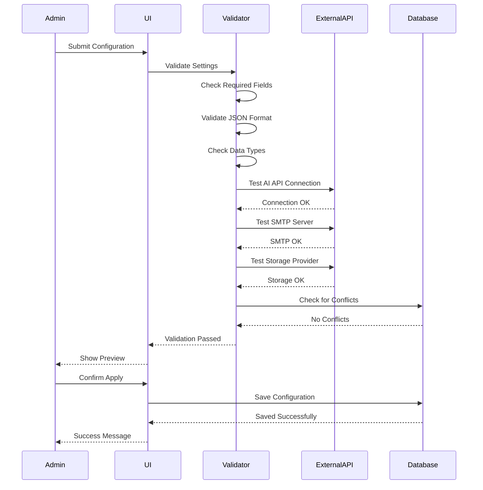
```mermaid
sequenceDiagram
    participant Admin
    participant UI
    participant Validator
    participant ExternalAPI
    participant Database
    
    Admin->>UI: Submit Configuration
    UI->>Validator: Validate Settings
    
    Validator->>Validator: Check Required Fields
    Validator->>Validator: Validate JSON Format
    Validator->>Validator: Check Data Types
    
    Validator->>ExternalAPI: Test AI API Connection
    ExternalAPI-->>Validator: Connection OK
    
    Validator->>ExternalAPI: Test SMTP Server
    ExternalAPI-->>Validator: SMTP OK
    
    Validator->>ExternalAPI: Test Storage Provider
    ExternalAPI-->>Validator: Storage OK
    
    Validator->>Database: Check for Conflicts
    Database-->>Validator: No Conflicts
    
    Validator-->>UI: Validation Passed
    UI-->>Admin: Show Preview
    
    Admin->>UI: Confirm Apply
    UI->>Database: Save Configuration
    Database-->>UI: Saved Successfully
    UI-->>Admin: Success Message
```

#### 3.3.3 Configuration Sections

**1. Platform Settings**
```yaml
platform:
  name: "Civic AI Canon Platform"
  timezone: "UTC"
  default_language: "en"
  date_format: "YYYY-MM-DD"
  time_format: "24h"
```

**2. AI & Model Configuration**
```yaml
ai:
  default_provider: "openai"
  api_timeout: 30
  max_retries: 3
  enable_streaming: true
  enable_function_calling: true
```

**3. Security Settings**
```yaml
security:
  encryption_algorithm: "AES-256"
  password_policy:
    min_length: 12
    require_uppercase: true
    require_lowercase: true
    require_numbers: true
    require_special: true
    expiry_days: 90
  session_timeout: 3600
  max_login_attempts: 5
  lockout_duration: 900
```

**4. Compliance Settings**
```yaml
compliance:
  enable_policy_enforcement: true
  auto_scan_frequency: "hourly"
  violation_auto_escalate: true
  critical_sla_hours: 8
  high_sla_hours: 24
```

---

## 4. AI Module Workflows

### 4.1 Chat Session Workflow

#### 4.1.1 Complete Session Lifecycle


```mermaid
flowchart TD
    Start([User Clicks New Chat]) --> SelectModel[Select AI Model]
    SelectModel --> SetTitle[Set Session Title]
    SetTitle --> ChooseType[Choose Session Type]
    ChooseType --> CreateSession[Create Session Record]
    
    CreateSession --> Active[Session Active]
    Active --> SendMsg[User Sends Message]
    
    SendMsg --> PreCheck[Pre-Send Compliance Check]
    PreCheck --> ViolationFound{Violation Detected?}
    
    ViolationFound -->|Yes| CheckLevel{Blocking Level?}
    CheckLevel -->|Blocking| BlockMsg[Block Message]
    BlockMsg --> ShowError[Show Error to User]
    ShowError --> Active
    
    CheckLevel -->|Warning| ShowWarning[Show Warning]
    ShowWarning --> UserConfirm{User Confirms?}
    UserConfirm -->|No| Active
    UserConfirm -->|Yes| ProceedSend
    
    ViolationFound -->|No| ProceedSend[Proceed with Send]
    ProceedSend --> StoreUserMsg[Store User Message]
    StoreUserMsg --> CallAI[Call AI Model API]
    
    CallAI --> RateLimit{Rate Limit OK?}
    RateLimit -->|No| HandleLimit[Handle Rate Limit]
    HandleLimit --> Wait{Behavior = Wait?}
    Wait -->|Yes| Sleep[Sleep & Retry]
    Sleep --> CallAI
    Wait -->|No| CheckFallback{Has Fallback?}
    CheckFallback -->|Yes| UseFallback[Use Fallback Model]
    CheckFallback -->|No| FailRequest[Return Error]
    FailRequest --> Active
    
    RateLimit -->|Yes| SendToAI[Send Request to AI]
    UseFallback --> SendToAI
    
    SendToAI --> APIResponse{API Success?}
    APIResponse -->|No| RetryLogic{Retry Available?}
    RetryLogic -->|Yes| CallAI
    RetryLogic -->|No| LogError[Log Error]
    LogError --> Active
    
    APIResponse -->|Yes| ParseResponse[Parse AI Response]
    ParseResponse --> TrackUsage[Track Token Usage]
    TrackUsage --> CalcCost[Calculate Cost]
    CalcCost --> StoreAIMsg[Store AI Message]
    
    StoreAIMsg --> PostCheck[Post-Response Compliance]
    PostCheck --> UpdateStats[Update Session Statistics]
    UpdateStats --> BroadcastUpdate[Broadcast Real-time Update]
    BroadcastUpdate --> Active
    
    Active --> CompleteSession{Complete Session?}
    CompleteSession -->|Yes| SetEndTime[Set End Time]
    SetEndTime --> CalcDuration[Calculate Duration]
    CalcDuration --> FinalCompliance[Run Final Compliance Check]
    FinalCompliance --> GenerateSummary[Generate Session Summary]
    GenerateSummary --> Completed[Session Completed]
    
    Completed --> NeedsReview{Needs Review?}
    NeedsReview -->|Yes| AssignReviewer[Assign to Reviewer]
    AssignReviewer --> UnderReview[Under Review]
    UnderReview --> ReviewComplete[Review Complete]
    ReviewComplete --> Archive
    
    NeedsReview -->|No| Archive[Archive Session]
    Archive --> End([End])
    
    style Start fill:#90EE90
    style Active fill:#87CEEB
    style Completed fill:#90EE90
    style BlockMsg fill:#FFB6C1
    style End fill:#90EE90
```

#### 4.1.2 Message Processing Sequence

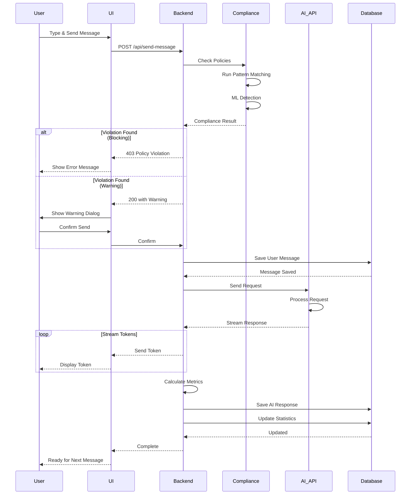
```mermaid
sequenceDiagram
    participant User
    participant UI
    participant Backend
    participant Compliance
    participant AI_API
    participant Database
    
    User->>UI: Type & Send Message
    UI->>Backend: POST /api/send-message
    
    Backend->>Compliance: Check Policies
    Compliance->>Compliance: Run Pattern Matching
    Compliance->>Compliance: ML Detection
    Compliance-->>Backend: Compliance Result
    
    alt Violation Found (Blocking)
        Backend-->>UI: 403 Policy Violation
        UI-->>User: Show Error Message
    else Violation Found (Warning)
        Backend-->>UI: 200 with Warning
        UI->>User: Show Warning Dialog
        User->>UI: Confirm Send
        UI->>Backend: Confirm
    end
    
    Backend->>Database: Save User Message
    Database-->>Backend: Message Saved
    
    Backend->>AI_API: Send Request
    AI_API->>AI_API: Process Request
    AI_API-->>Backend: Stream Response
    
    loop Stream Tokens
        Backend-->>UI: Send Token
        UI-->>User: Display Token
    end
    
    Backend->>Backend: Calculate Metrics
    Backend->>Database: Save AI Response
    Backend->>Database: Update Statistics
    Database-->>Backend: Updated
    
    Backend-->>UI: Complete
    UI-->>User: Ready for Next Message
```

#### 4.1.3 Session Statistics Tracking

**Tracked Metrics:**

| Metric | Description | Update Frequency |
|--------|-------------|------------------|
| Total Messages | Count of user + AI messages | Real-time |
| Total Tokens | Input + Output tokens | Real-time |
| Total Cost | Cumulative AI cost | Real-time |
| Average Response Time | Mean AI response latency | Real-time |
| Violations Count | Number of policy violations | Real-time |
| Compliance Score | 0-100 score | On completion |
| Session Duration | Start to end time | On completion |

**Statistics Update Flow:**

```python
class ChatSession:
    def increment_message_count(self, count=1):
        self.total_messages += count
        self.save()
    
    def update_token_usage(self, tokens):
        self.total_tokens += tokens
        # Recalculate cost
        model = frappe.get_doc("Model Configuration", self.model_configuration)
        self.total_cost += (tokens / 1000) * model.output_cost_per_1k
        self.save()
    
    def update_response_time(self, response_time_ms):
        # Calculate running average
        total = self.avg_response_time * (self.total_messages - 1)
        self.avg_response_time = (total + response_time_ms) / self.total_messages
        self.save()
    
    def calculate_compliance_score(self):
        # Score based on violations
        if self.total_messages == 0:
            return 100
        
        violation_penalty = self.violations_count * 10
        score = 100 - violation_penalty
        return max(0, min(100, score))
```

---

### 4.2 AI Model Configuration Workflow

#### 4.2.1 Model Lifecycle Diagram

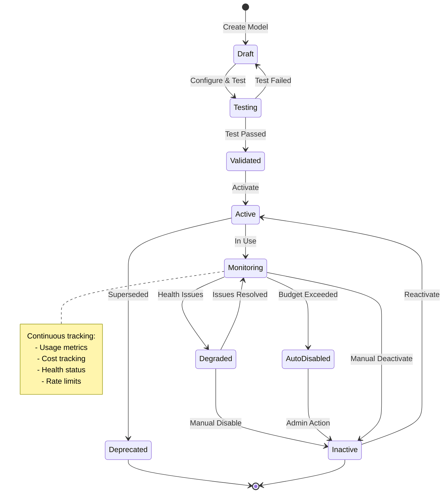
```mermaid
stateDiagram-v2
    [*] --> Draft: Create Model
    Draft --> Testing: Configure & Test
    Testing --> Validated: Test Passed
    Testing --> Draft: Test Failed
    
    Validated --> Active: Activate
    Active --> Monitoring: In Use
    
    Monitoring --> Degraded: Health Issues
    Degraded --> Monitoring: Issues Resolved
    Degraded --> Inactive: Manual Disable
    
    Monitoring --> AutoDisabled: Budget Exceeded
    AutoDisabled --> Inactive: Admin Action
    
    Monitoring --> Inactive: Manual Deactivate
    Inactive --> Active: Reactivate
    
    Active --> Deprecated: Superseded
    Deprecated --> [*]
    Inactive --> [*]
    
    note right of Monitoring
        Continuous tracking:
        - Usage metrics
        - Cost tracking
        - Health status
        - Rate limits
    end note
```

#### 4.2.2 Model Configuration & Testing Flow

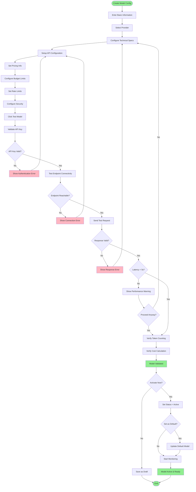
```mermaid
flowchart TD
    Start([Create Model Config]) --> BasicInfo[Enter Basic Information]
    BasicInfo --> Provider[Select Provider]
    Provider --> TechSpecs[Configure Technical Specs]
    TechSpecs --> APIConfig[Setup API Configuration]
    
    APIConfig --> Pricing[Set Pricing Info]
    Pricing --> Budget[Configure Budget Limits]
    Budget --> RateLimits[Set Rate Limits]
    RateLimits --> Security[Configure Security]
    
    Security --> TestModel[Click Test Model]
    TestModel --> ValidateAPI[Validate API Key]
    
    ValidateAPI --> APIValid{API Key Valid?}
    APIValid -->|No| ShowAPIError[Show Authentication Error]
    ShowAPIError --> APIConfig
    
    APIValid -->|Yes| TestEndpoint[Test Endpoint Connectivity]
    TestEndpoint --> EndpointOK{Endpoint Reachable?}
    EndpointOK -->|No| ShowConnError[Show Connection Error]
    ShowConnError --> APIConfig
    
    EndpointOK -->|Yes| SendTestReq[Send Test Request]
    SendTestReq --> ParseResp{Response Valid?}
    ParseResp -->|No| ShowRespError[Show Response Error]
    ShowRespError --> TechSpecs
    
    ParseResp -->|Yes| CheckLatency{Latency < 5s?}
    CheckLatency -->|No| ShowPerfWarning[Show Performance Warning]
    ShowPerfWarning --> ConfirmProceed{Proceed Anyway?}
    ConfirmProceed -->|No| TechSpecs
    ConfirmProceed -->|Yes| VerifyTokens
    
    CheckLatency -->|Yes| VerifyTokens[Verify Token Counting]
    VerifyTokens --> VerifyCost[Verify Cost Calculation]
    VerifyCost --> Validated[Model Validated]
    
    Validated --> Activate{Activate Now?}
    Activate -->|Yes| SetActive[Set Status = Active]
    Activate -->|No| SaveDraft[Save as Draft]
    
    SetActive --> CheckDefault{Set as Default?}
    CheckDefault -->|Yes| UpdateDefault[Update Default Model]
    CheckDefault -->|No| StartMonitor
    UpdateDefault --> StartMonitor[Start Monitoring]
    
    StartMonitor --> Active[Model Active & Ready]
    SaveDraft --> End([End])
    Active --> End
    
    style Start fill:#90EE90
    style Validated fill:#90EE90
    style Active fill:#90EE90
    style End fill:#90EE90
    style ShowAPIError fill:#FFB6C1
    style ShowConnError fill:#FFB6C1
    style ShowRespError fill:#FFB6C1
```

#### 4.2.3 Usage Monitoring & Budget Control

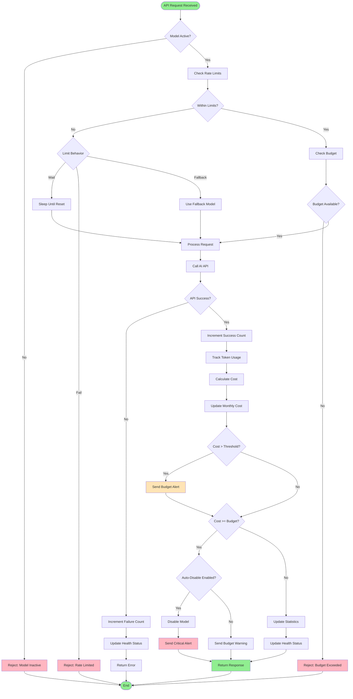
```mermaid
flowchart TD
    Request([API Request Received]) --> CheckActive{Model Active?}
    CheckActive -->|No| RejectInactive[Reject: Model Inactive]
    CheckActive -->|Yes| CheckRateLimit[Check Rate Limits]
    
    CheckRateLimit --> RateLimitOK{Within Limits?}
    RateLimitOK -->|No| HandleLimit{Limit Behavior}
    
    HandleLimit -->|Wait| Sleep[Sleep Until Reset]
    Sleep --> ProcessReq
    HandleLimit -->|Fail| RejectRate[Reject: Rate Limited]
    HandleLimit -->|Fallback| SwitchModel[Use Fallback Model]
    SwitchModel --> ProcessReq
    
    RateLimitOK -->|Yes| CheckBudget[Check Budget]
    CheckBudget --> BudgetOK{Budget Available?}
    BudgetOK -->|No| RejectBudget[Reject: Budget Exceeded]
    BudgetOK -->|Yes| ProcessReq[Process Request]
    
    ProcessReq --> CallAPI[Call AI API]
    CallAPI --> APIResp{API Success?}
    
    APIResp -->|No| IncrementFail[Increment Failure Count]
    IncrementFail --> UpdateHealthFail[Update Health Status]
    UpdateHealthFail --> ReturnError[Return Error]
    
    APIResp -->|Yes| IncrementSuccess[Increment Success Count]
    IncrementSuccess --> TrackTokens[Track Token Usage]
    TrackTokens --> CalculateCost[Calculate Cost]
    CalculateCost --> UpdateMonthlyCost[Update Monthly Cost]
    
    UpdateMonthlyCost --> CheckThreshold{Cost > Threshold?}
    CheckThreshold -->|Yes| SendAlert[Send Budget Alert]
    SendAlert --> CheckExceeded
    CheckThreshold -->|No| CheckExceeded{Cost >= Budget?}
    
    CheckExceeded -->|Yes| AutoDisable{Auto-Disable Enabled?}
    AutoDisable -->|Yes| DisableModel[Disable Model]
    DisableModel --> SendCritical[Send Critical Alert]
    SendCritical --> ReturnResponse
    AutoDisable -->|No| SendWarning[Send Budget Warning]
    SendWarning --> ReturnResponse
    
    CheckExceeded -->|No| UpdateStats[Update Statistics]
    UpdateStats --> UpdateHealth[Update Health Status]
    UpdateHealth --> ReturnResponse[Return Response]
    
    ReturnResponse --> End([End])
    RejectInactive --> End
    RejectRate --> End
    RejectBudget --> End
    ReturnError --> End
    
    style Request fill:#90EE90
    style ReturnResponse fill:#90EE90
    style End fill:#90EE90
    style RejectInactive fill:#FFB6C1
    style RejectRate fill:#FFB6C1
    style RejectBudget fill:#FFB6C1
    style SendCritical fill:#FFB6C1
    style SendAlert fill:#FFE4B5
```

#### 4.2.4 Health Monitoring System

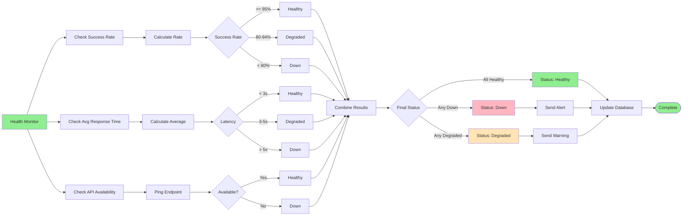
```mermaid
flowchart LR
    Monitor[Health Monitor] --> CheckSuccess[Check Success Rate]
    Monitor --> CheckLatency[Check Avg Response Time]
    Monitor --> CheckAvail[Check API Availability]
    
    CheckSuccess --> CalcRate[Calculate Rate]
    CheckLatency --> CalcAvg[Calculate Average]
    CheckAvail --> PingAPI[Ping Endpoint]
    
    CalcRate --> EvalSuccess{Success Rate}
    CalcAvg --> EvalLatency{Latency}
    PingAPI --> EvalAvail{Available?}
    
    EvalSuccess -->|>= 95%| Healthy1[Healthy]
    EvalSuccess -->|80-94%| Degraded1[Degraded]
    EvalSuccess -->|< 80%| Down1[Down]
    
    EvalLatency -->|< 3s| Healthy2[Healthy]
    EvalLatency -->|3-5s| Degraded2[Degraded]
    EvalLatency -->|> 5s| Down2[Down]
    
    EvalAvail -->|Yes| Healthy3[Healthy]
    EvalAvail -->|No| Down3[Down]
    
    Healthy1 --> Combine[Combine Results]
    Healthy2 --> Combine
    Healthy3 --> Combine
    Degraded1 --> Combine
    Degraded2 --> Combine
    Down1 --> Combine
    Down2 --> Combine
    Down3 --> Combine
    
    Combine --> FinalStatus{Final Status}
    FinalStatus -->|All Healthy| SetHealthy[Status: Healthy]
    FinalStatus -->|Any Down| SetDown[Status: Down]
    FinalStatus -->|Any Degraded| SetDegraded[Status: Degraded]
    
    SetHealthy --> UpdateDB[Update Database]
    SetDown --> SendAlert[Send Alert]
    SetDegraded --> SendWarning[Send Warning]
    
    SendAlert --> UpdateDB
    SendWarning --> UpdateDB
    UpdateDB --> Complete([Complete])
    
    style Monitor fill:#90EE90
    style SetHealthy fill:#90EE90
    style SetDegraded fill:#FFE4B5
    style SetDown fill:#FFB6C1
    style Complete fill:#90EE90
```

---

## 5. Compliance Module Workflows

### 5.1 Policy Lifecycle Workflow

#### 5.1.1 Complete Policy Lifecycle

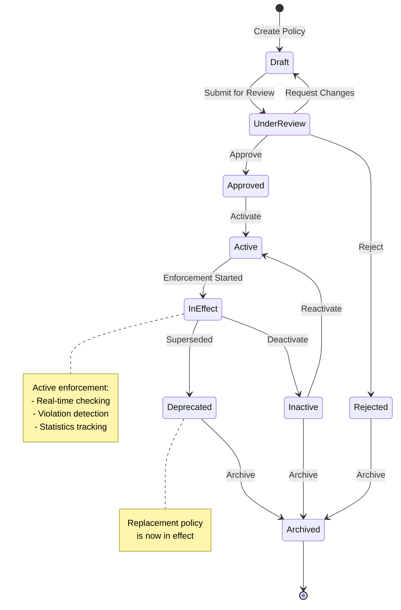
```mermaid
stateDiagram-v2
    [*] --> Draft: Create Policy
    Draft --> UnderReview: Submit for Review
    UnderReview --> Approved: Approve
    UnderReview --> Rejected: Reject
    UnderReview --> Draft: Request Changes
    
    Approved --> Active: Activate
    Active --> InEffect: Enforcement Started
    
    InEffect --> Inactive: Deactivate
    Inactive --> Active: Reactivate
    
    InEffect --> Deprecated: Superseded
    Deprecated --> Archived: Archive
    
    Inactive --> Archived: Archive
    Rejected --> Archived: Archive
    
    Archived --> [*]
    
    note right of InEffect
        Active enforcement:
        - Real-time checking
        - Violation detection
        - Statistics tracking
    end note
    
    note right of Deprecated
        Replacement policy
        is now in effect
    end note
```

#### 5.1.2 Policy Review & Approval Process


```mermaid
flowchart TD
    Start([Policy Created]) --> FillDetails[Fill Policy Details]
    FillDetails --> DefineRules[Define Policy Rules]
    DefineRules --> SetEnforcement[Set Enforcement Level]
    SetEnforcement --> SetScope[Define Scope]
    SetScope --> ValidateDraft{Draft Valid?}
    
    ValidateDraft -->|No| ShowErrors[Show Validation Errors]
    ShowErrors --> FillDetails
    
    ValidateDraft -->|Yes| Submit[Submit for Review]
    Submit --> CreateReview[Create Review Queue Item]
    CreateReview --> AssignReviewer[Assign to Reviewer]
    AssignReviewer --> UnderReview[Under Review State]
    
    UnderReview --> ReviewerCheck[Reviewer Examines Policy]
    ReviewerCheck --> Completeness[Check Completeness]
    Completeness --> TechnicalVal[Technical Validation]
    TechnicalVal --> ComplianceCheck[Compliance Check]
    ComplianceCheck --> RiskAssess[Risk Assessment]
    
    RiskAssess --> Decision{Review Decision}
    
    Decision -->|Approve| RecordApproval[Record Approval]
    RecordApproval --> Approved[Approved State]
    Approved --> NotifyOwner1[Notify Policy Owner]
    
    Decision -->|Request Changes| AddComments[Add Review Comments]
    AddComments --> SendBack[Send Back to Draft]
    SendBack --> NotifyOwner2[Notify Policy Owner]
    NotifyOwner2 --> FillDetails
    
    Decision -->|Reject| RecordRejection[Record Rejection Reason]
    RecordRejection --> Rejected[Rejected State]
    Rejected --> NotifyOwner3[Notify Policy Owner]
    NotifyOwner3 --> EndReject([End])
    
    NotifyOwner1 --> ActivateOption{Activate Policy?}
    ActivateOption -->|Yes| RunPreActivation[Pre-Activation Checks]
    ActivateOption -->|No| SaveApproved[Save as Approved]
    SaveApproved --> EndApproved([End])
    
    RunPreActivation --> CheckConflicts{Conflicts Found?}
    CheckConflicts -->|Yes| ResolveConflicts[Resolve Conflicts]
    ResolveConflicts --> RunPreActivation
    
    CheckConflicts -->|No| LoadEngine[Load into Compliance Engine]
    LoadEngine --> CompileRules[Compile Policy Rules]
    CompileRules --> IndexPatterns[Index Patterns]
    IndexPatterns --> CheckSupersede{Supersedes Other Policy?}
    
    CheckSupersede -->|Yes| DeprecateOld[Deprecate Old Policy]
    DeprecateOld --> LinkPolicies[Link Policies]
    LinkPolicies --> SetActive
    
    CheckSupersede -->|No| SetActive[Set Status = Active]
    SetActive --> LogActivation[Log Activation Event]
    LogActivation --> BlockchainAnchor[Anchor to Ledger]
    BlockchainAnchor --> SendNotifications[Send Notifications]
    SendNotifications --> StartEnforcement[Start Real-time Enforcement]
    
    StartEnforcement --> Active[Policy Active & In Effect]
    Active --> EndActive([End])
    
    style Start fill:#90EE90
    style Active fill:#90EE90
    style Approved fill:#90EE90
    style Rejected fill:#FFB6C1
    style UnderReview fill:#FFE4B5
```

#### 5.1.3 Real-Time Policy Enforcement

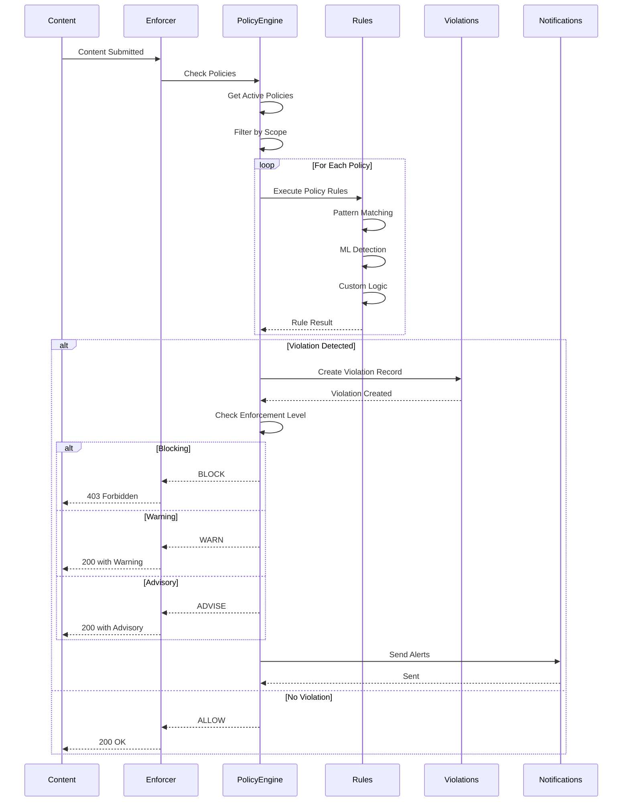
```mermaid
sequenceDiagram
    participant Content
    participant Enforcer
    participant PolicyEngine
    participant Rules
    participant Violations
    participant Notifications
    
    Content->>Enforcer: Content Submitted
    Enforcer->>PolicyEngine: Check Policies
    
    PolicyEngine->>PolicyEngine: Get Active Policies
    PolicyEngine->>PolicyEngine: Filter by Scope
    
    loop For Each Policy
        PolicyEngine->>Rules: Execute Policy Rules
        Rules->>Rules: Pattern Matching
        Rules->>Rules: ML Detection
        Rules->>Rules: Custom Logic
        Rules-->>PolicyEngine: Rule Result
    end
    
    alt Violation Detected
        PolicyEngine->>Violations: Create Violation Record
        Violations-->>PolicyEngine: Violation Created
        
        PolicyEngine->>PolicyEngine: Check Enforcement Level
        
        alt Blocking
            PolicyEngine-->>Enforcer: BLOCK
            Enforcer-->>Content: 403 Forbidden
        else Warning
            PolicyEngine-->>Enforcer: WARN
            Enforcer-->>Content: 200 with Warning
        else Advisory
            PolicyEngine-->>Enforcer: ADVISE
            Enforcer-->>Content: 200 with Advisory
        end
        
        PolicyEngine->>Notifications: Send Alerts
        Notifications-->>PolicyEngine: Sent
    else No Violation
        PolicyEngine-->>Enforcer: ALLOW
        Enforcer-->>Content: 200 OK
    end
```

---

### 5.2 Violation Detection & Resolution Workflow

#### 5.2.1 Complete Violation Lifecycle


```mermaid
flowchart TD
    Detection([Violation Detected]) --> CreateRecord[Create Violation Record]
    CreateRecord --> SetSeverity[Set Severity from Policy]
    SetSeverity --> CalcRisk[Calculate Risk Score]
    CalcRisk --> CheckRecurrence[Check for Recurrence]
    
    CheckRecurrence --> IsRecurring{Is Recurring?}
    IsRecurring -->|Yes| IncrementCount[Increment Recurrence Count]
    IncrementCount --> BoostRisk[Boost Risk Score]
    BoostRisk --> OpenState
    
    IsRecurring -->|No| OpenState[Open State]
    
    OpenState --> Triage[Automatic Triage]
    Triage --> CheckCritical{Critical Severity?}
    
    CheckCritical -->|Yes| ImmediateNotify[Send Immediate Alert]
    ImmediateNotify --> AutoEscalate[Auto-Escalate]
    AutoEscalate --> AssignSenior[Assign to Senior Investigator]
    
    CheckCritical -->|No| CheckConfidence{Confidence Score}
    CheckConfidence -->|Low < 0.6| ManualReview[Route to Manual Review]
    CheckConfidence -->|High >= 0.6| AutoAssign[Auto-Assign by Workload]
    
    ManualReview --> AssignReviewer[Assign to Reviewer]
    AutoAssign --> AssignReviewer
    AssignSenior --> UnderInvestigation
    AssignReviewer --> UnderInvestigation[Under Investigation]
    
    UnderInvestigation --> InvestigatorReview[Investigator Reviews]
    InvestigatorReview --> ExamineContent[Examine Source Content]
    ExamineContent --> CheckPolicy[Review Policy]
    CheckPolicy --> AssessContext[Assess Context]
    AssessContext --> GatherEvidence[Gather Evidence]
    
    GatherEvidence --> Determination{Validity Determination}
    
    Determination -->|False Positive| MarkFalse[Mark as False Positive]
    MarkFalse --> FeedbackPolicy[Send Feedback to Policy Owner]
    FeedbackPolicy --> CloseFalse[Close as False Positive]
    CloseFalse --> EndFalse([End])
    
    Determination -->|Needs Escalation| EscalateFlow[Escalation Flow]
    EscalateFlow --> FindEscTarget[Find Escalation Target]
    FindEscTarget --> IncEscLevel[Increment Escalation Level]
    IncEscLevel --> ReassignEsc[Reassign to Higher Authority]
    ReassignEsc --> NotifyEsc[Notify Escalation Target]
    NotifyEsc --> UnderInvestigation
    
    Determination -->|Confirmed| ConfirmViolation[Confirm Violation]
    ConfirmViolation --> PlanRemediation[Plan Remediation]
    
    PlanRemediation --> CreateActions[Create Action Items]
    CreateActions --> SetDeadlines[Set Deadlines by Severity]
    SetDeadlines --> AssignActions[Assign Actions]
    AssignActions --> RemediationProgress[Remediation In Progress]
    
    RemediationProgress --> ExecuteActions[Execute Actions]
    ExecuteActions --> ActionLoop{More Actions?}
    ActionLoop -->|Yes| ExecuteActions
    ActionLoop -->|No| AllComplete{All Complete?}
    
    AllComplete -->|No| CheckDeadline{Deadline Passed?}
    CheckDeadline -->|Yes| SendReminder[Send Deadline Reminder]
    SendReminder --> ExecuteActions
    CheckDeadline -->|No| ExecuteActions
    
    AllComplete -->|Yes| Verification[Verification Phase]
    Verification --> VerifyActions[Verify All Actions]
    VerifyActions --> CheckCompliance[Check Policy Compliance]
    CheckCompliance --> CheckSideEffects[Check for Side Effects]
    
    CheckSideEffects --> VerificationOK{Verification Passed?}
    VerificationOK -->|No| AddMoreActions[Add Additional Actions]
    AddMoreActions --> RemediationProgress
    
    VerificationOK -->|Yes| RecordResolution[Record Resolution]
    RecordResolution --> SelectCategory[Select Resolution Category]
    SelectCategory --> EnterSummary[Enter Resolution Summary]
    EnterSummary --> ResolvedState[Resolved State]
    
    ResolvedState --> UpdateStats[Update Policy Statistics]
    UpdateStats --> CreateEvent[Create Compliance Event]
    CreateEvent --> NotifyStakeholders[Notify Stakeholders]
    NotifyStakeholders --> ClosedState[Closed State]
    
    ClosedState --> ArchiveData[Archive Violation Data]
    ArchiveData --> UpdateMetrics[Update System Metrics]
    UpdateMetrics --> EndResolved([End])
    
    style Detection fill:#90EE90
    style MarkFalse fill:#FFE4B5
    style ResolvedState fill:#90EE90
    style ClosedState fill:#90EE90
    style AutoEscalate fill:#FFB6C1
```

#### 5.2.2 Risk Score Calculation

```mermaid
flowchart LR
    Start([Calculate Risk]) --> GetSeverity[Get Base Severity Score]
    GetSeverity --> SevScore{Severity}
    
    SevScore -->|Critical| Set90[Base = 90]
    SevScore -->|High| Set70[Base = 70]
    SevScore -->|Medium| Set40[Base = 40]
    SevScore -->|Low| Set10[Base = 10]
    
    Set90 --> CheckRecur
    Set70 --> CheckRecur
    Set40 --> CheckRecur
    Set10 --> CheckRecur[Check Recurrence]
    
    CheckRecur --> RecurCount{Recurrence Count}
    RecurCount -->|> 0| AddRecur[Add Count × 5]
    RecurCount -->|= 0| ApplyConf
    AddRecur --> ApplyConf[Apply Confidence]
    
    ApplyConf --> MultConf[Multiply by Confidence Score]
    MultConf --> CheckEsc{Escalated?}
    
    CheckEsc -->|Yes| Add10[Add 10 Points]
    CheckEsc -->|No| CapScore
    Add10 --> CapScore[Cap at 100]
    
    CapScore --> FinalScore[Final Risk Score]
    FinalScore --> End([End])
    
    style Start fill:#90EE90
    style FinalScore fill:#87CEEB
    style End fill:#90EE90
```

**Risk Score Formula:**
```python
def calculate_risk_score(violation):
    # Base severity score
    severity_map = {
        "Critical": 90,
        "High": 70,
        "Medium": 40,
        "Low": 10
    }
    base_score = severity_map.get(violation.severity, 40)
    
    # Add recurrence penalty
    recurrence_penalty = violation.recurrence_count * 5
    
    # Apply confidence score (0.0 - 1.0)
    confidence_factor = violation.confidence_score or 1.0
    
    # Escalation bonus
    escalation_bonus = 10 if violation.escalated else 0
    
    # Calculate final score
    risk_score = (base_score + recurrence_penalty) * confidence_factor + escalation_bonus
    
    # Cap at 100
    return min(risk_score, 100)
```

#### 5.2.3 Remediation Action Workflow

```mermaid
stateDiagram-v2
    [*] --> Pending: Create Action
    Pending --> InProgress: Start Work
    InProgress --> Blocked: Issue Found
    Blocked --> InProgress: Issue Resolved
    InProgress --> Completed: Work Finished
    Completed --> Verified: Verification Passed
    Verified --> [*]
    
    note right of Pending
        Action assigned,
        awaiting start
    end note
    
    note right of Blocked
        Cannot proceed
        due to dependency
    end note
```

---

### 5.3 Review Queue Workflow

#### 5.3.1 Review Queue Management

```mermaid
flowchart TD
    Start([Item Submitted]) --> CreateReview[Create Review Queue Item]
    CreateReview --> SetPriority[Set Priority]
    SetPriority --> CalcSLA[Calculate Due Date from SLA]
    CalcSLA --> CheckAutoAssign{Auto-Assign Enabled?}
    
    CheckAutoAssign -->|Yes| FindReviewers[Get Eligible Reviewers]
    FindReviewers --> CalcWorkload[Calculate Workload]
    CalcWorkload --> AssignLeast[Assign to Least Loaded]
    AssignLeast --> Pending
    
    CheckAutoAssign -->|No| Pending[Pending State]
    
    Pending --> InQueue[Item in Queue]
    InQueue --> ReviewerClaim{Reviewer Claims?}
    ReviewerClaim -->|Manual Claim| AssignManual[Manual Assignment]
    ReviewerClaim -->|Waiting| MonitorSLA
    AssignManual --> InReview
    
    MonitorSLA[Monitor SLA] --> CheckTime{Time Remaining}
    CheckTime -->|> 24h| InQueue
    CheckTime -->|< 24h| Warning[SLA Warning]
    Warning --> SendWarningNotif[Send Warning Notification]
    SendWarningNotif --> CheckBreach{Due Date Passed?}
    
    CheckBreach -->|No| InQueue
    CheckBreach -->|Yes| Breached[SLA Breached]
    Breached --> LogBreach[Log Breach Event]
    LogBreach --> CheckAutoEsc{Auto-Escalate?}
    
    CheckAutoEsc -->|Yes| Escalate[Escalate to Manager]
    Escalate --> IncrementLevel[Increment Escalation Level]
    IncrementLevel --> ReassignEsc[Reassign]
    ReassignEsc --> InReview
    
    CheckAutoEsc -->|No| SendBreachNotif[Send Breach Notification]
    SendBreachNotif --> InQueue
    
    InReview[In Review State] --> ReviewerWork[Reviewer Works on Item]
    ReviewerWork --> UseChecklist[Follow Checklist]
    UseChecklist --> GatherInfo[Gather Information]
    GatherInfo --> AddComments[Add Comments]
    AddComments --> MakeDecision{Decision}
    
    MakeDecision -->|Approve| RecordApprove[Record Approval]
    RecordApprove --> Approved[Approved State]
    Approved --> ExecuteApproval[Execute Approval Actions]
    ExecuteApproval --> NotifyApprove[Notify Submitter]
    NotifyApprove --> Complete
    
    MakeDecision -->|Reject| RecordReject[Record Rejection]
    RecordReject --> Rejected[Rejected State]
    Rejected --> ExecuteReject[Execute Rejection Actions]
    ExecuteReject --> NotifyReject[Notify Submitter]
    NotifyReject --> Complete
    
    MakeDecision -->|Request Changes| RecordChanges[Record Required Changes]
    RecordChanges --> PendingChanges[Pending Changes State]
    PendingChanges --> NotifyChanges[Notify Submitter]
    NotifyChanges --> WaitChanges[Wait for Resubmission]
    WaitChanges --> CheckResubmit{Resubmitted?}
    CheckResubmit -->|Yes| InReview
    CheckResubmit -->|No| WaitChanges
    
    Complete[Complete State] --> UpdateRef[Update Referenced Document]
    UpdateRef --> LogDecision[Log Decision Event]
    LogDecision --> CloseReview[Close Review Item]
    CloseReview --> End([End])
    
    style Start fill:#90EE90
    style Approved fill:#90EE90
    style Complete fill:#90EE90
    style End fill:#90EE90
    style Rejected fill:#FFB6C1
    style Breached fill:#FFB6C1
    style Warning fill:#FFE4B5
```

#### 5.3.2 SLA Monitoring System

```mermaid
flowchart LR
    Monitor[SLA Monitor Job] --> GetItems[Get All Active Reviews]
    GetItems --> Loop{For Each Item}
    
    Loop -->|Process| CalcRemaining[Calculate Time Remaining]
    CalcRemaining --> UpdateStatus{Status}
    
    UpdateStatus -->|> Warning Threshold| OnTrack[Status: On Track]
    UpdateStatus -->|< Warning Threshold| WarningStatus[Status: Warning]
    UpdateStatus -->|Past Due| BreachStatus[Status: Breached]
    
    OnTrack --> NextItem
    WarningStatus --> SendWarn[Send Warning Email]
    SendWarn --> NextItem
    BreachStatus --> LogEvent[Log Breach Event]
    LogEvent --> CheckEsc{Auto-Escalate?}
    CheckEsc -->|Yes| TriggerEsc[Trigger Escalation]
    CheckEsc -->|No| SendBreach[Send Breach Alert]
    TriggerEsc --> NextItem
    SendBreach --> NextItem
    
    NextItem[Next Item] --> Loop
    Loop -->|Done| Complete([Complete])
    
    style Monitor fill:#90EE90
    style OnTrack fill:#90EE90
    style WarningStatus fill:#FFE4B5
    style BreachStatus fill:#FFB6C1
    style Complete fill:#90EE90
```

**SLA Configuration by Priority:**

| Priority | SLA Hours | Warning Threshold | Auto-Escalate |
|----------|-----------|-------------------|---------------|
| Critical | 8 | 2 hours before | Yes |
| High | 24 | 6 hours before | Yes |
| Medium | 72 | 24 hours before | No |
| Low | 168 (7 days) | 48 hours before | No |

---

## 6. Operations Module Workflows

### 6.1 Evidence Management Workflow

#### 6.1.1 Complete Evidence Lifecycle

```mermaid
stateDiagram-v2
    [*] --> Draft: Create Evidence
    Draft --> PendingVerification: Submit
    
    PendingVerification --> AutoVerify: Auto-Verify
    PendingVerification --> ManualVerify: Manual Review
    
    AutoVerify --> Verified: Checks Passed
    AutoVerify --> Failed: Checks Failed
    
    ManualVerify --> Verified: Approved
    ManualVerify --> Rejected: Rejected
    ManualVerify --> Failed: Failed
    
    Failed --> Draft: Fix Issues
    Rejected --> Draft: Address Feedback
    
    Verified --> Active: Start Using
    Active --> Active: Create Links
    Active --> Expired: Retention Exceeded
    Expired --> Archived: Archive
    Archived --> [*]
    
    note right of Verified
        Evidence can be used
        in compliance processes
    end note
    
    note right of Active
        Chain of custody
        tracked for all actions
    end note
```

#### 6.1.2 Evidence Verification Process

```mermaid
flowchart TD
    Start([Submit Evidence]) --> CheckMode{Verification Mode}
    
    CheckMode -->|Automated| AutoVerif[Automated Verification]
    CheckMode -->|Manual| CreateReview[Create Review Queue Item]
    
    AutoVerif --> CheckIntegrity[Verify Content Integrity]
    CheckIntegrity --> IntegrityOK{Integrity Valid?}
    IntegrityOK -->|No| FailIntegrity[Fail: Integrity Check]
    IntegrityOK -->|Yes| CheckFormat[Validate Format]
    
    CheckFormat --> FormatOK{Format Valid?}
    FormatOK -->|No| FailFormat[Fail: Invalid Format]
    FormatOK -->|Yes| CheckSize[Check Size Limits]
    
    CheckSize --> SizeOK{Within Limits?}
    SizeOK -->|No| FailSize[Fail: Size Exceeded]
    SizeOK -->|Yes| VirusScan{Has Attachments?}
    
    VirusScan -->|Yes| RunScan[Run Virus Scan]
    RunScan --> ScanClean{Scan Clean?}
    ScanClean -->|No| FailVirus[Fail: Virus Detected]
    ScanClean -->|Yes| CheckMeta
    
    VirusScan -->|No| CheckMeta[Validate Metadata]
    CheckMeta --> MetaOK{Metadata Valid?}
    MetaOK -->|No| FailMeta[Fail: Invalid Metadata]
    MetaOK -->|Yes| AutoVerified[Auto-Verified]
    
    FailIntegrity --> Failed[Verification Failed]
    FailFormat --> Failed
    FailSize --> Failed
    FailVirus --> Failed
    FailMeta --> Failed
    
    Failed --> NotifyFail[Notify Submitter]
    NotifyFail --> CanRetry{Fix & Retry?}
    CanRetry -->|Yes| Start
    CanRetry -->|No| Rejected[Rejected State]
    
    AutoVerified --> RecordVerif[Record Verification]
    RecordVerif --> AddCustody[Add Custody Entry]
    AddCustody --> Verified
    
    CreateReview --> AssignReviewer[Assign to Reviewer]
    AssignReviewer --> ManualReview[Manual Review]
    ManualReview --> ReviewContent[Review Content]
    ReviewContent --> CheckSource[Verify Source]
    CheckSource --> AssessQuality[Assess Quality]
    AssessQuality --> ReviewDecision{Decision}
    
    ReviewDecision -->|Approve| RecordApproval[Record Approval]
    RecordApproval --> RecordVerif
    
    ReviewDecision -->|Reject| RecordRejection[Record Rejection Reason]
    RecordRejection --> NotifyReject[Notify Submitter]
    NotifyReject --> Rejected
    
    Verified[Verified State] --> UpdateStatus[Set Status = Verified]
    UpdateStatus --> EnableUse[Enable for Use]
    EnableUse --> End([End])
    
    Rejected --> EndReject([End])
    
    style Start fill:#90EE90
    style Verified fill:#90EE90
    style AutoVerified fill:#90EE90
    style End fill:#90EE90
    style Failed fill:#FFB6C1
    style Rejected fill:#FFB6C1
```

#### 6.1.3 Chain of Custody Tracking

```mermaid
sequenceDiagram
    participant User
    participant Evidence
    participant Custody
    participant Audit
    participant Blockchain
    
    User->>Evidence: Create Evidence
    Evidence->>Custody: Add Entry: "Created"
    Custody->>Audit: Log Creation
    
    User->>Evidence: Submit for Verification
    Evidence->>Custody: Add Entry: "Submitted"
    Custody->>Audit: Log Submission
    
    User->>Evidence: Verify Evidence
    Evidence->>Custody: Add Entry: "Verified"
    Custody->>Audit: Log Verification
    Custody->>Blockchain: Anchor Hash
    
    User->>Evidence: Link to Message
    Evidence->>Custody: Add Entry: "Linked to MSG-001"
    Custody->>Audit: Log Link Creation
    
    User->>Evidence: View Evidence
    Evidence->>Custody: Add Entry: "Accessed by User"
    Custody->>Audit: Log Access
    
    User->>Evidence: Export Evidence
    Evidence->>Custody: Add Entry: "Exported"
    Custody->>Audit: Log Export
    
    User->>Evidence: Archive Evidence
    Evidence->>Custody: Add Entry: "Archived"
    Custody->>Audit: Log Archive
    Custody->>Blockchain: Final Anchor
```

**Custody Entry Structure:**

```python
class CustodyEntry:
    timestamp: datetime      # When action occurred
    action: str             # Action performed
    performed_by: str       # User who performed action
    ip_address: str         # IP address
    description: str        # Detailed description
    metadata: dict          # Additional context
    hash_before: str        # Content hash before action
    hash_after: str         # Content hash after action
    blockchain_tx: str      # Blockchain transaction ID (if anchored)
```

---

### 6.2 Audit Log Workflow

#### 6.2.1 Audit Logging Flow

```mermaid
flowchart TD
    Event([System Event Occurs]) --> CheckType{Event Type}
    
    CheckType -->|Auth| CaptureAuth[Capture Auth Details]
    CheckType -->|Data| CaptureData[Capture Data Changes]
    CheckType -->|Policy| CapturePolicy[Capture Policy Event]
    CheckType -->|System| CaptureSystem[Capture System Event]
    CheckType -->|Security| CaptureSecurity[Capture Security Event]
    
    CaptureAuth --> BuildLog
    CaptureData --> BuildLog
    CapturePolicy --> BuildLog
    CaptureSystem --> BuildLog
    CaptureSecurity --> BuildLog[Build Log Entry]
    
    BuildLog --> SetTimestamp[Set Timestamp]
    SetTimestamp --> CaptureActor[Capture Actor Info]
    CaptureActor --> CaptureTarget[Capture Target Info]
    CaptureTarget --> CaptureChanges[Capture Changes]
    CaptureChanges --> SetSeverity[Set Severity]
    SetSeverity --> AddContext[Add Context]
    
    AddContext --> CreateLog[Create Audit Log Record]
    CreateLog --> StoreLog[Store in Database]
    StoreLog --> IndexLog[Index for Search]
    IndexLog --> CheckAlerts{Alert Rules?}
    
    CheckAlerts -->|Match| EvalRule[Evaluate Alert Rule]
    CheckAlerts -->|No Match| Complete
    
    EvalRule --> RuleTriggered{Rule Triggered?}
    RuleTriggered -->|Yes| CreateAlert[Create Alert]
    CreateAlert --> SendNotif[Send Notifications]
    SendNotif --> Complete
    
    RuleTriggered -->|No| Complete[Complete]
    Complete --> End([End])
    
    style Event fill:#90EE90
    style CreateLog fill:#87CEEB
    style CreateAlert fill:#FFB6C1
    style Complete fill:#90EE90
    style End fill:#90EE90
```

#### 6.2.2 Alert Rule Evaluation

```mermaid
flowchart LR
    NewLog[New Audit Log] --> GetRules[Get Active Alert Rules]
    GetRules --> Loop{For Each Rule}
    
    Loop -->|Process| CheckType{Rule Type}
    
    CheckType -->|Failed Logins| CountFails[Count Failed Logins]
    CountFails --> FailThreshold{Count >= Threshold?}
    FailThreshold -->|Yes| TriggerFail[Trigger Alert]
    FailThreshold -->|No| NextRule
    
    CheckType -->|Data Access| CountAccess[Count Access Events]
    CountAccess --> AccessThreshold{Count >= Threshold?}
    AccessThreshold -->|Yes| TriggerAccess[Trigger Alert]
    AccessThreshold -->|No| NextRule
    
    CheckType -->|Permission Change| DetectChange[Detect Privilege Escalation]
    DetectChange --> ChangeDetected{Suspicious?}
    ChangeDetected -->|Yes| TriggerChange[Trigger Alert]
    ChangeDetected -->|No| NextRule
    
    CheckType -->|Custom Pattern| EvalPattern[Evaluate Pattern]
    EvalPattern --> PatternMatch{Pattern Matches?}
    PatternMatch -->|Yes| TriggerPattern[Trigger Alert]
    PatternMatch -->|No| NextRule
    
    TriggerFail --> SendAlert
    TriggerAccess --> SendAlert
    TriggerChange --> SendAlert
    TriggerPattern --> SendAlert[Send Alert Notification]
    
    SendAlert --> LogAlert[Log Alert Event]
    LogAlert --> NextRule
    
    NextRule[Next Rule] --> Loop
    Loop -->|Done| Complete([Complete])
    
    style NewLog fill:#90EE90
    style TriggerFail fill:#FFB6C1
    style TriggerAccess fill:#FFB6C1
    style TriggerChange fill:#FFB6C1
    style TriggerPattern fill:#FFB6C1
    style Complete fill:#90EE90
```

**Common Alert Rules:**

1. **Multiple Failed Logins**
   - Trigger: 5+ failed logins in 15 minutes
   - Action: Lock account, notify security team

2. **Suspicious Data Access**
   - Trigger: 100+ document reads in 5 minutes
   - Action: Alert security team, flag user

3. **Privilege Escalation**
   - Trigger: Role assignment to admin role
   - Action: Notify admins immediately

4. **Off-Hours Access**
   - Trigger: Access outside business hours
   - Action: Log and review next day

5. **Bulk Delete Operations**
   - Trigger: 50+ deletes in 10 minutes
   - Action: Halt operation, alert admins

---

## 7. Analytics Module Workflows

### 7.1 Metrics Collection Workflow

#### 7.1.1 Real-Time Metrics Pipeline

```mermaid
flowchart LR
    Event[System Event] --> Instrument[Instrumentation Point]
    Instrument --> Collect[Metrics Collector]
    
    Collect --> Buffer[Metrics Buffer]
    Buffer --> Aggregate{Aggregation Window}
    
    Aggregate -->|Full| Process[Process Batch]
    Aggregate -->|Not Full| Buffer
    
    Process --> Calculate[Calculate Statistics]
    Calculate --> Store[Store in Time-Series DB]
    Store --> Index[Update Indexes]
    Index --> Notify[Notify Subscribers]
    
    Notify --> Dashboard[Update Dashboards]
    Notify --> Alerts[Check Alert Thresholds]
    
    Alerts --> ThresholdMet{Threshold Met?}
    ThresholdMet -->|Yes| SendAlert[Send Alert]
    ThresholdMet -->|No| Complete
    
    SendAlert --> Complete[Complete]
    Dashboard --> Complete
    Complete --> Ready([Ready for Next Event])
    
    style Event fill:#90EE90
    style Buffer fill:#87CEEB
    style Store fill:#87CEEB
    style SendAlert fill:#FFB6C1
    style Ready fill:#90EE90
```

#### 7.1.2 Batch Metrics Calculation

```mermaid
flowchart TD
    Scheduler([Scheduled Job Triggered]) --> GetTenants[Get All Active Tenants]
    GetTenants --> SetPeriod[Define Time Period]
    SetPeriod --> LoopTenants{For Each Tenant}
    
    LoopTenants -->|Process| CollectMsg[Collect Message Metrics]
    CollectMsg --> CollectSession[Collect Session Metrics]
    CollectSession --> CollectViolation[Collect Violation Metrics]
    CollectViolation --> CollectAI[Collect AI Metrics]
    CollectAI --> CollectCompliance[Collect Compliance Metrics]
    
    CollectCompliance --> CalcStats[Calculate Statistics]
    CalcStats --> CalcAvg[Calculate Averages]
    CalcAvg --> CalcTrends[Calculate Trends]
    CalcTrends --> CalcScore[Calculate Scores]
    
    CalcScore --> StoreMetrics[Store Metrics]
    StoreMetrics --> NextTenant[Next Tenant]
    NextTenant --> LoopTenants
    
    LoopTenants -->|Done| UpdateDashboards[Update All Dashboards]
    UpdateDashboards --> GenerateReports{Generate Reports?}
    
    GenerateReports -->|Yes| CreateReports[Create Report Documents]
    CreateReports --> DistributeReports[Distribute Reports]
    DistributeReports --> Complete
    
    GenerateReports -->|No| Complete[Complete]
    Complete --> End([End])
    
    style Scheduler fill:#90EE90
    style Complete fill:#90EE90
    style End fill:#90EE90
```

---

### 7.2 Reporting Workflow

#### 7.2.1 Report Generation Process

```mermaid
flowchart TD
    Trigger([Report Trigger]) --> CheckType{Trigger Type}
    
    CheckType -->|Scheduled| GetSchedule[Get Report Schedule]
    CheckType -->|On-Demand| GetParams[Get User Parameters]
    
    GetSchedule --> LoadTemplate
    GetParams --> LoadTemplate[Load Report Template]
    
    LoadTemplate --> DefineScope[Define Data Scope]
    DefineScope --> SetDateRange[Set Date Range]
    SetDateRange --> SelectMetrics[Select Metrics]
    SelectMetrics --> CollectData[Collect Data]
    
    CollectData --> QueryDB[Query Database]
    QueryDB --> QueryTimeSeries[Query Time-Series Data]
    QueryTimeSeries --> QueryAudit[Query Audit Logs]
    QueryAudit --> AggregateData[Aggregate Data]
    
    AggregateData --> ProcessData[Process Data]
    ProcessData --> CalcKPIs[Calculate KPIs]
    CalcKPIs --> GenerateCharts[Generate Charts]
    GenerateCharts --> ApplyTemplate[Apply Template]
    
    ApplyTemplate --> FormatOutput{Output Format}
    
    FormatOutput -->|PDF| GeneratePDF[Generate PDF]
    FormatOutput -->|Excel| GenerateExcel[Generate Excel]
    FormatOutput -->|HTML| GenerateHTML[Generate HTML]
    FormatOutput -->|JSON| GenerateJSON[Generate JSON]
    
    GeneratePDF --> StoreReport
    GenerateExcel --> StoreReport
    GenerateHTML --> StoreReport
    GenerateJSON --> StoreReport[Store Report]
    
    StoreReport --> CreateRecord[Create Report Record]
    CreateRecord --> Distribute{Distribution Needed?}
    
    Distribute -->|Yes| GetRecipients[Get Recipients]
    GetRecipients --> ComposeEmail[Compose Email]
    ComposeEmail --> AttachReport[Attach Report Files]
    AttachReport --> SendEmail[Send Email]
    SendEmail --> LogDistribution[Log Distribution]
    LogDistribution --> Complete
    
    Distribute -->|No| Complete[Complete]
    Complete --> End([End])
    
    style Trigger fill:#90EE90
    style Complete fill:#90EE90
    style End fill:#90EE90
```

#### 7.2.2 Report Types & Schedules

```mermaid
gantt
    title Report Generation Schedule
    dateFormat YYYY-MM-DD
    section Daily Reports
    Compliance Daily Report    :2025-10-23, 1d
    Usage Summary             :2025-10-23, 1d
    section Weekly Reports
    Compliance Weekly         :2025-10-20, 7d
    Cost Analysis            :2025-10-20, 7d
    User Activity            :2025-10-20, 7d
    section Monthly Reports
    Executive Summary         :2025-10-01, 30d
    Financial Report         :2025-10-01, 30d
    Trend Analysis           :2025-10-01, 30d
```

---

## 8. Cross-Module Workflows

### 8.1 End-to-End Message with Compliance

#### 8.1.1 Complete Message Flow

```mermaid
sequenceDiagram
    participant User
    participant UI
    participant API
    participant Compliance
    participant AI
    participant Database
    participant Metrics
    
    User->>UI: Type Message
    User->>UI: Click Send
    
    UI->>API: POST /send-message
    API->>Compliance: Pre-Send Check
    
    Compliance->>Database: Get Active Policies
    Database-->>Compliance: Policies List
    
    loop For Each Policy
        Compliance->>Compliance: Check Patterns
        Compliance->>Compliance: Run ML Detection
    end
    
    alt Blocking Violation
        Compliance-->>API: BLOCK
        API->>Database: Create Violation Record
        API-->>UI: 403 Policy Violation
        UI-->>User: Show Error
    else Warning Violation
        Compliance-->>API: WARN
        API-->>UI: 200 with Warning
        UI->>User: Show Warning Dialog
        User->>UI: Confirm
        UI->>API: Confirmed
    else No Violation
        Compliance-->>API: ALLOW
    end
    
    API->>Database: Save User Message
    Database-->>API: Saved
    
    API->>AI: Send Request
    AI->>AI: Process with Model
    AI-->>API: Stream Response
    
    loop Stream Tokens
        API-->>UI: Token Chunk
        UI-->>User: Display Token
    end
    
    API->>Metrics: Track Usage
    Metrics->>Metrics: Update Counters
    Metrics->>Metrics: Calculate Cost
    
    API->>Database: Save AI Response
    API->>Database: Update Session Stats
    Database-->>API: Updated
    
    API->>Compliance: Post-Response Check
    Compliance-->>API: Check Complete
    
    API-->>UI: Message Complete
    UI-->>User: Ready for Next
```

---

## 9. Background Jobs & Automation

### 9.1 Scheduled Jobs Overview

```mermaid
gantt
    title Background Job Schedule
    dateFormat HH:mm
    axisFormat %H:%M
    
    section Every Minute
    Heartbeat           :00:00, 1m
    Cleanup Idle Sessions :00:00, 1m
    Check Alerts        :00:00, 1m
    
    section Every 5 Minutes
    Quick Compliance    :00:00, 5m
    System Health       :00:00, 5m
    Update SLA Status   :00:00, 5m
    
    section Hourly
    Blockchain Anchor   :00:00, 60m
    Calculate Metrics   :00:00, 60m
    Compliance Scans    :00:00, 60m
    Reset Rate Limits   :00:00, 60m
    
    section Daily
    Generate Reports    :00:00, 1d
    Archive Sessions    :00:00, 1d
    Backup Evidence     :00:00, 1d
    Check Expiration    :00:00, 1d
```

### 9.2 Event-Driven Automation

```mermaid
flowchart TD
    Events[Event Stream] --> Router[Event Router]
    
    Router --> ViolationEvent{Violation Detected}
    Router --> SLAEvent{SLA Breach}
    Router --> BudgetEvent{Budget Exceeded}
    Router --> PolicyEvent{Policy Activated}
    
    ViolationEvent --> CreateViolation[Create Violation Record]
    CreateViolation --> CheckCritical{Critical?}
    CheckCritical -->|Yes| ImmediateAlert[Send Immediate Alert]
    CheckCritical -->|No| StandardFlow[Standard Processing]
    ImmediateAlert --> AutoAssign
    StandardFlow --> AutoAssign[Auto-Assign to Reviewer]
    AutoAssign --> UpdateScore[Update Compliance Score]
    
    SLAEvent --> LogBreach[Log Breach Event]
    LogBreach --> SendEscalation[Send Escalation]
    SendEscalation --> AutoEscalateCheck{Auto-Escalate?}
    AutoEscalateCheck -->|Yes| Escalate[Escalate Item]
    AutoEscalateCheck -->|No| NotifyOnly[Notify Only]
    
    BudgetEvent --> DisableCheck{Auto-Disable?}
    DisableCheck -->|Yes| DisableModel[Disable AI Model]
    DisableCheck -->|No| WarnOnly[Send Warning]
    DisableModel --> CriticalNotif[Send Critical Alert]
    WarnOnly --> LogEvent
    CriticalNotif --> LogEvent[Log Event]
    
    PolicyEvent --> LoadEngine[Load to Compliance Engine]
    LoadEngine --> DeprecateOld[Deprecate Old Policy]
    DeprecateOld --> SendActivation[Send Activation Notifications]
    SendActivation --> AnchorLedger[Anchor to Ledger]
    
    UpdateScore --> Complete
    Escalate --> Complete
    NotifyOnly --> Complete
    LogEvent --> Complete
    AnchorLedger --> Complete[Complete]
    
    Complete --> End([End])
    
    style Events fill:#90EE90
    style ImmediateAlert fill:#FFB6C1
    style CriticalNotif fill:#FFB6C1
    style Complete fill:#90EE90
    style End fill:#90EE90
```

---

## 10. Integration Workflows

### 10.1 AI Provider Integration

```mermaid
flowchart TD
    Request([AI Request]) --> CheckCache{Response Cached?}
    CheckCache -->|Yes| ReturnCached[Return Cached Response]
    CheckCache -->|No| CheckRate[Check Rate Limits]
    
    CheckRate --> RateOK{Within Limits?}
    RateOK -->|No| HandleLimit{Limit Behavior}
    
    HandleLimit -->|Wait| WaitReset[Wait for Reset]
    WaitReset --> FormatReq
    HandleLimit -->|Fail| ReturnError[Return Error]
    HandleLimit -->|Fallback| UseFallback[Switch to Fallback]
    UseFallback --> FormatReq
    
    RateOK -->|Yes| FormatReq[Format Request]
    FormatReq --> AddHeaders[Add API Headers]
    AddHeaders --> CallAPI[Call Provider API]
    
    CallAPI --> Retry{Retry Logic}
    Retry -->|Attempt 1| Try1[Try Request]
    Retry -->|Attempt 2| Try2[Retry After Delay]
    Retry -->|Attempt 3| Try3[Final Retry]
    
    Try1 --> Success1{Success?}
    Success1 -->|No| Try2
    Success1 -->|Yes| ParseResp
    
    Try2 --> Success2{Success?}
    Success2 -->|No| Try3
    Success2 -->|Yes| ParseResp
    
    Try3 --> Success3{Success?}
    Success3 -->|No| LogFailure[Log Failure]
    Success3 -->|Yes| ParseResp[Parse Response]
    
    LogFailure --> UpdateHealth[Update Health Status]
    UpdateHealth --> ReturnError
    
    ParseResp --> ExtractData[Extract Data]
    ExtractData --> CountTokens[Count Tokens]
    CountTokens --> CalcCost[Calculate Cost]
    CalcCost --> UpdateMetrics[Update Metrics]
    UpdateMetrics --> CacheResp{Cacheable?}
    
    CacheResp -->|Yes| StoreCache[Store in Cache]
    CacheResp -->|No| ReturnResp
    StoreCache --> ReturnResp[Return Response]
    
    ReturnCached --> End
    ReturnResp --> End([End])
    ReturnError --> End
    
    style Request fill:#90EE90
    style ReturnResp fill:#90EE90
    style ReturnCached fill:#90EE90
    style End fill:#90EE90
    style LogFailure fill:#FFB6C1
    style ReturnError fill:#FFB6C1
```

### 10.2 Multi-Channel Notification

```mermaid
flowchart LR
    Event[Notification Event] --> Generator[Notification Generator]
    Generator --> CreateMsg[Create Message]
    CreateMsg --> DetermineChannels{Determine Channels}
    
    DetermineChannels --> EmailQ[Email Queue]
    DetermineChannels --> SlackQ[Slack Queue]
    DetermineChannels --> TeamsQ[Teams Queue]
    DetermineChannels --> BrowserQ[Browser Push Queue]
    DetermineChannels --> SMSQ[SMS Queue]
    
    EmailQ --> BatchEmail[Batch Processor]
    SlackQ --> BatchSlack[Batch Processor]
    TeamsQ --> BatchTeams[Batch Processor]
    BrowserQ --> RealtimeBrowser[Real-time Sender]
    SMSQ --> BatchSMS[Batch Processor]
    
    BatchEmail --> SendEmail[Send via SMTP]
    BatchSlack --> SendSlack[Send via Slack API]
    BatchTeams --> SendTeams[Send via Teams API]
    RealtimeBrowser --> SendBrowser[Send via WebSocket]
    BatchSMS --> SendSMS[Send via SMS API]
    
    SendEmail --> Track
    SendSlack --> Track
    SendTeams --> Track
    SendBrowser --> Track
    SendSMS --> Track[Track Delivery]
    
    Track --> UpdateStatus[Update Status]
    UpdateStatus --> Complete([Complete])
    
    style Event fill:#90EE90
    style Complete fill:#90EE90
```

### 10.3 Storage Integration

```mermaid
flowchart TD
    Upload([File Upload]) --> Validate[Validate File]
    Validate --> CheckType{File Type Allowed?}
    CheckType -->|No| RejectType[Reject: Invalid Type]
    CheckType -->|Yes| CheckSize{Size Within Limit?}
    
    CheckSize -->|No| RejectSize[Reject: Too Large]
    CheckSize -->|Yes| VirusScan[Virus Scan]
    
    VirusScan --> ScanResult{Clean?}
    ScanResult -->|No| Quarantine[Quarantine File]
    Quarantine --> AlertSecurity[Alert Security]
    AlertSecurity --> RejectVirus[Reject: Virus Detected]
    
    ScanResult -->|Yes| Encrypt{Encryption Required?}
    Encrypt -->|Yes| EncryptFile[Encrypt File]
    Encrypt -->|No| SelectProvider
    EncryptFile --> SelectProvider[Select Storage Provider]
    
    SelectProvider --> Provider{Provider Type}
    Provider -->|S3| UploadS3[Upload to S3]
    Provider -->|Azure| UploadAzure[Upload to Azure Blob]
    Provider -->|GCS| UploadGCS[Upload to Google Cloud]
    Provider -->|Local| UploadLocal[Save Locally]
    
    UploadS3 --> GenURL
    UploadAzure --> GenURL
    UploadGCS --> GenURL
    UploadLocal --> GenURL[Generate Access URL]
    
    GenURL --> SaveMetadata[Save Metadata]
    SaveMetadata --> CreateRecord[Create File Record]
    CreateRecord --> Success[Upload Successful]
    
    Success --> End([End])
    RejectType --> End
    RejectSize --> End
    RejectVirus --> End
    
    style Upload fill:#90EE90
    style Success fill:#90EE90
    style End fill:#90EE90
    style RejectType fill:#FFB6C1
    style RejectSize fill:#FFB6C1
    style RejectVirus fill:#FFB6C1
    style Quarantine fill:#FFB6C1
```

---

## Conclusion

This comprehensive workflows documentation provides visual and detailed descriptions of all major processes within the Civic AI Canon Platform. Each workflow is designed with:

✅ **Clear Visual Representation**: Mermaid diagrams for easy understanding  
✅ **State Management**: Well-defined states and transitions  
✅ **Error Handling**: Robust exception and recovery flows  
✅ **Compliance Integration**: Policy enforcement at every step  
✅ **Auditability**: Complete tracking and logging  
✅ **Scalability**: Efficient processing for high volume  
✅ **Security**: Proper authorization and data protection  
✅ **Automation**: Event-driven and scheduled automation  

### Key Takeaways

1. **Modular Design**: Each workflow is self-contained but integrates seamlessly
2. **Compliance-First**: Every process includes compliance checks
3. **Real-Time & Batch**: Mix of real-time processing and batch operations
4. **Monitoring**: Continuous health and performance monitoring
5. **Audit Trail**: Complete tracking of all actions and changes

### Related Documentation

- **User Guide**: For end-user instructions on using these workflows
- **Developer Guide**: For implementation details and API references
- **Use Case Scenarios**: For practical examples of workflows in action

---

**Document Version:** 2.0.0  
**Last Updated:** 2025-10-23  
**Author:** Ashraf Al-hajj & Raasid

*This document contains visual workflow diagrams that may require a Markdown viewer with Mermaid support for optimal viewing.*
